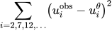

<p align="center">
  
</p>


The ADCME library (**A**utomatic **D**ifferentiation Library for **C**omputational and **M**athematical **E**ngineering) aims at general and scalable inverse modeling in scientific computing with gradient-based optimization techniques. It is built on the deep learning framework, **graph-mode [TensorFlow](https://www.tensorflow.org/)**, which provides the automatic differentiation and parallel computing backend. The dataflow model adopted by the framework makes it suitable for high performance computing and inverse modeling in scientific computing. The design principles and methodologies are summarized in the [slides](https://kailaix.github.io/ADCME.jl/dev/assets/Slide/ADCME.pdf).

Several features of the library are

* **MATLAB-style Syntax**. Write `A*B` for matrix production instead of `tf.matmul(A,B)`.
* **Custom Operators**. Implement operators in C/C++ for performance critical parts; incorporate legacy code or specially designed C/C++ code in `ADCME`; automatic differentiation through implicit schemes and iterative solvers. 
* **Numerical Scheme**. Easy to implement numerical schemes for solving PDEs.
* **Physics Constrained Learning**. Embed neural network into PDEs and solve with any numerical schemes, including implicit and iterative schemes. 
* **Static Graphs**. Compilation time computational graph optimization; automatic parallelism for your simulation codes.
* **Parallel Computing**. Concurrent execution and model/data parallel distributed optimization. 
* **Custom Optimizers**. Large scale constrained optimization? Use `CustomOptimizer` to integrate your favorite optimizer. Try out prebuilt [Ipopt and NLopt](https://kailaix.github.io/ADCME.jl/dev/customopt/#Dropin-substitute-of-BFGS!-1) optimizers. 
* **Sparse Linear Algebra**. Sparse linear algebra library tailored for scientific computing. 
* **Inverse Modeling**. Many inverse modeling algorithms have been developed and implemented in ADCME, with wide applications in solid mechanics, fluid dynamics, geophysics, and stochastic processes. 

Start building your forward and inverse modeling using ADCME today!

| Documentation                                                | Tutorial                                                     | Applications                                                     |
| ------------------------------------------------------------ | ------------------------------------------------------------ | ------------------------------------------------------------ |
| [](https://kailaix.github.io/ADCME.jl/dev) | [](https://kailaix.github.io/ADCME.jl/dev/tutorial/) | [](https://kailaix.github.io/ADCME.jl/dev/apps) |

## Graph-mode TensorFlow for High Performance Scientific Computing

Static computational graph (graph-mode AD) enables compilation time optimization. Below is a benchmark of common AD software from [here](https://github.com/microsoft/ADBench). In inverse modeling, we usually have a scalar-valued objective function, so the left panel is most relevant for ADCME. 


# Installation

1. Install [Julia](https://julialang.org/). The following configuration has been tested:

⚠️Tested Configuration

|         |  Julia 1.3 | Julia 1.4 | GPU | Custom Operator |
|---------| ----- |-------|-----|-----------------|
| Linux   |✔ | ✔  | ✔   | ✔               |
| MacOS   |✔ |  ✕  | ✕   | ✔               |
| Windows | ✔ | ✔  | ✕   | ✕               |


2. Install `ADCME`
```
using Pkg
Pkg.add("ADCME")
```

3. Run the ADCME built-in `doctor` and follow instructions to fix computing environment problems
```julia
using ADCME
doctor()
```

3. (Optional) Test `ADCME.jl`
```
using Pkg
Pkg.test("ADCME")
```
See [Troubleshooting](https://kailaix.github.io/ADCME.jl/dev/tu_customop/#Troubleshooting-1) if you encounter any compilation problems.

4. (Optional) Enable GPU Support
To enable GPU support, first, make sure `nvcc` is available from your environment (e.g., type `nvcc` in your shell and you should get the location of the executable binary file).
```julia
ENV["GPU"] = 1
Pkg.build("ADCME")
```

For manual installation without access to the internet, see [here](https://kailaix.github.io/ADCME.jl/dev/).


# Tutorial

Here we present two inverse problem examples. The first one is a parameter estimation problem, and the second one is a function inverse problem. 

### Parameter Inverse Problem 

Consider solving the following problem


where 


Assume that we have observed `u(0.5)=1`, we want to estimate `b`.  In this case, he true value should be `b=1`.

```julia
using LinearAlgebra
using ADCME

n = 101 # number of grid nodes in [0,1]
h = 1/(n-1)
x = LinRange(0,1,n)[2:end-1]

b = Variable(10.0) # we use Variable keyword to mark the unknowns
A = diagm(0=>2/h^2*ones(n-2), -1=>-1/h^2*ones(n-3), 1=>-1/h^2*ones(n-3)) 
B = b*A + I  # I stands for the identity matrix
f = @. 4*(2 + x - x^2) 
u = B\f # solve the equation using built-in linear solver
ue = u[div(n+1,2)] # extract values at x=0.5

loss = (ue-1.0)^2 

# Optimization
sess = Session(); init(sess) 
BFGS!(sess, loss)

println("Estimated b = ", run(sess, b))
```
Expected output 
```
Estimated b = 0.9995582304494237
```

The gradients can be obtained very easily. For example, if we want the gradients of `loss` with respect to `b`, the following code will create a Tensor for the gradient
```
julia> gradients(loss, b)
PyObject <tf.Tensor 'gradients_1/Mul_grad/Reshape:0' shape=() dtype=float64>
```

### Function Inverse Problem: Full Field Data

Consider a nonlinear PDE, 


where 


Here `f(x)` can be computed from an analytical solution 


In this problem, we are given the full field data of `u(x)` (the discrete value of `u(x)` is given on a very fine grid) and want to estimate the nonparametric function `b(u)`. We approximate `b(u)` using a neural network and use the [residual minimization method](https://kailaix.github.io/ADCME.jl/dev/tu_nn/) to find the optimal weights and biases of the neural network. The minimization problem is given by 


```julia
using LinearAlgebra
using ADCME
using PyPlot

n = 101 
h = 1/(n-1)
x = LinRange(0,1,n)|>collect

u = sin.(π*x)
f = @. (1+u^2)/(1+2u^2) * π^2 * u + u 
# `fc` is short for fully connected neural network. 
# Here we create a neural network with 2 hidden layers, and 20 neuron per layer. 
# The default activation function is tanh.
b = squeeze(fc(u[2:end-1], [20,20,1])) 

residual = -b.*(u[3:end]+u[1:end-2]-2u[2:end-1])/h^2 + u[2:end-1] - f[2:end-1]
loss = sum(residual^2)

sess = Session(); init(sess)
BFGS!(sess, loss)

plot(x, (@. (1+x^2)/(1+2*x^2)), label="Reference")
plot(u[2:end-1], run(sess, b), "o", markersize=5., label="Estimated")
legend(); xlabel("\$u\$"); ylabel("\$b(u)\$"); grid("on")
```

Here we show the estimated coefficient function and the reference one:

<p align="center">
  
</p>

### Function Inverse Problem: Sparse Data

Now we consider the same problem as above, but only consider we have access to sparse observations. We assume that on the grid only the values of `u(x)` on every other 5th grid point are observable. We use the [physics constrained learning](https://arxiv.org/pdf/2002.10521.pdf) technique and train a neural network surrogate for `b(u)` by minimizing 



Here `uᶿ` is the solution to the PDE with


We add 1 to the neural network to ensure the initial guess does not result in a singular Jacobian matrix in the Newton Raphson solver.

```julia
using LinearAlgebra
using ADCME
using PyPlot

n = 101 
h = 1/(n-1)
x = LinRange(0,1,n)|>collect

u = sin.(π*x)
f = @. (1+u^2)/(1+2u^2) * π^2 * u + u 

# we use a Newton Raphson solver to solve the nonlinear PDE problem 
function residual_and_jac(θ, x)
    nn = squeeze(fc(reshape(x,:,1), [20,20,1], θ)) + 1.0
    u_full = vector(2:n-1, x, n)
    res = -nn.*(u_full[3:end]+u_full[1:end-2]-2u_full[2:end-1])/h^2 + u_full[2:end-1] - f[2:end-1]
    J = gradients(res, x)
    res, J
end
θ = Variable(fc_init([1,20,20,1]))
ADCME.options.newton_raphson.rtol = 1e-4 # relative tolerance
ADCME.options.newton_raphson.tol = 1e-4 # absolute tolerance
ADCME.options.newton_raphson.verbose = true # print details in newton_raphson
u_est = newton_raphson_with_grad(residual_and_jac, constant(zeros(n-2)),θ)
residual = u_est[1:5:end] - u[2:end-1][1:5:end]
loss = sum(residual^2)

b = squeeze(fc(reshape(x,:,1), [20,20,1], θ)) + 1.0
sess = Session(); init(sess)
BFGS!(sess, loss)

figure(figsize=(10,4))
subplot(121)
plot(x, (@. (1+x^2)/(1+2*x^2)), label="Reference")
plot(x, run(sess, b), "o", markersize=5., label="Estimated")
legend(); xlabel("\$u\$"); ylabel("\$b(u)\$"); grid("on")
subplot(122)
plot(x, (@. sin(π*x)), label="Reference")
plot(x[2:end-1], run(sess, u_est), "--", label="Estimated")
plot(x[2:end-1][1:5:end], run(sess, u_est)[1:5:end], "x", markersize=5., label="Data")
legend(); xlabel("\$x\$"); ylabel("\$u\$"); grid("on")
```

We show the reconstructed `b(u)` and the solution `u` computed from `b(u)`. We see that even though the neural network model fits the data very well, `b(u)` is not the same as the true one. This problem is ubiquitous in inverse modeling, where the unknown may not be unique. 


See [Applications](https://kailaix.github.io/ADCME.jl/dev/tutorial/) for more inverse modeling techniques and examples.

### Under the Hood: Computational Graph

Under the hood, a static computational graph is automatic constructed. The computational graph guides the runtime execution and provides dependencies of  data flows for automatic differentiation. Here we show the computational graph in the parameter inverse problem:


See a detailed [tutorial](https://kailaix.github.io/ADCME.jl/dev/tutorial/), or a full [documentation](https://kailaix.github.io/ADCME.jl/dev). 

# Featured Applications

| [Constitutive Modeling](https://kailaix.github.io/ADCME.jl/dev/apps_constitutive_law/) | [Seismic Inversion](https://kailaix.github.io/ADCME.jl/dev/apps_adseismic) | [Coupled Two-Phase Flow and Time-lapse FWI](https://kailaix.github.io/ADCME.jl/dev/apps_ad/) | [Calibrating Jump Diffusion](https://kailaix.github.io/ADCME.jl/dev/apps_levy/) |
| ------------------------------------------------------------ | ------------------------------------------------------------ | ------------------------------------------------------------ | ------------------------------------------------------------ |
|                               |                        |                               |                              |

**Domain specific software based on ADCME**

[ADSeismic.jl](https://github.com/kailaix/ADSeismic.jl): Inverse Problems in Earthquake Location/Source-Time Function, FWI, Rupture Process 

[FwiFlow.jl](https://github.com/lidongzh/FwiFlow.jl): Seismic Inversion, Two-phase Flow, Coupled seismic and flow equations 

[NNFEM.jl](https://github.com/kailaix/NNFEM.jl/): Constitutive Modeling, Elasticity, Plasticity, Hyperelasticity, Finite Element Method on Unstructured Grid 


# LICENSE

ADCME.jl is released under MIT License. See [License](https://github.com/kailaix/ADCME.jl/tree/master/LICENSE) for details. 


