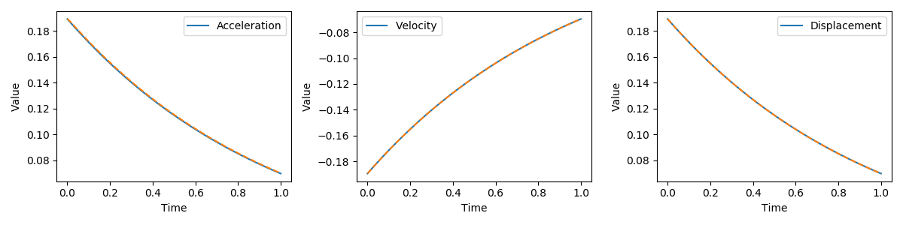

# Generalized α Scheme

## Generalized $\alpha$ Scheme

The generalized $\alpha$ scheme is used to solve the second order linear differential equation of the form 

$$M\mathbf{a} + C\mathbf v + K \mathbf d = \mathbf F$$

where $M$, $C$ and $K$ are the generalized mass, damping, and stiffness matrices, $\mathbf a$, $\mathbf v$, and $\mathbf d$ are the generalized acceleration, velocity, and displacement, and $\mathbf F$ is the generalized force vector. The generalized $\alpha$ scheme solves for a discrete time step

$$\begin{align}
\mathbf d_{n+1} &= \mathbf d_n + h\mathbf v_n + h^2 \left(\left(\frac{1}{2}-\beta_2 \right)\mathbf a_n + \beta_2 \mathbf a_{n+1}  \right)\\
\mathbf v_{n+1} &= \mathbf v_n + h((1-\gamma_2)\mathbf a_n + \gamma_2 \mathbf a_{n+1})\\
\mathbf F(t_{n+1-\alpha_{f_2}}) &= M \mathbf a _{n+1-\alpha_{m_2}} + C \mathbf v_{n+1-\alpha_{f_2}} + K \mathbf{d}_{n+1-\alpha_{f_2}}
\end{align}$$

Here $h$ is the time step and

$$\begin{aligned}
\mathbf d_{n+1-\alpha_{f_2}} &= (1-\alpha_{f_2})\mathbf d_{n+1} + \alpha_{f_2} \mathbf d_n\\
\mathbf v_{n+1-\alpha_{f_2}} &= (1-\alpha_{f_2}) \mathbf v_{n+1} + \alpha_{f_2} \mathbf v_n \\
\mathbf a_{n+1-\alpha_{m_2} } &= (1-\alpha_{m_2}) \mathbf a_{n+1} + \alpha_{m_2} \mathbf a_n\\
t_{n+1-\alpha_{f_2}} & = (1-\alpha_{f_2}) t_{n+1 + \alpha_{f_2}} + \alpha_{f_2}t_n
\end{aligned}$$

The parameters $\alpha_{f_2}$, $\alpha_{m_2}$, $\gamma_2$, and $\beta_2$ are used to control the amplification of high frequency numerical modes. High frequency modes normally describe motions with no physical sense (also contains very large phase error). Therefore, it is desirable to damp those high frequency modes. By properly choosing the parameters, we can recover HHT, Newmark, or WBZ methods. 

We can design new algorithms by taking $\rho_\infty\in [0,1]$ as a design variable to control the numerical dissipation above the normal frequency $\frac{h}{T}$, where $T$ is the period associated with the highest frequency of interest. The following relationships are used to obtain a good algorithm that are accurate and preserve low-frequency modes

$$\begin{aligned}
\gamma_2 &= \frac{1}{2} - \alpha_{m_2} + \alpha_{f_2}\\
\beta_2 &= \frac{1}{4} (1-\alpha_{m_2}+\alpha_{f_2})^2 \\
\alpha_{m_2} &= \frac{2\rho_\infty-1}{\rho_\infty+1}\\
\alpha_{f_2} &= \frac{\rho_\infty}{\rho_\infty+1}
\end{aligned}$$

The following figure provides a plot of spectral radii versus $\frac hT$[^radii]


[^radii]: http://www.dymoresolutions.com/AnalysisControls/CreateFEModel.html

In ADCME, we provide an API to the generalized $\alpha$ scheme, [`αscheme`](@ref), and [`αscheme_time`](@ref), which computes $t_{n+1-\alpha_{f_2}}$.

## Example: Viscosity

The [test code](https://github.com/kailaix/ADCME.jl/blob/master/test/ode.jl#L33) for [`αscheme`](@ref) shows a simple ODE example. In this section, we show how to use the generalized $\alpha$ scheme to solve the viscosity problem. The governing equation is given by 

$$\begin{align}
\sigma_{3j,j} + f &= \ddot u \\
\sigma_{3j} &= \dot \epsilon_{3j}
\end{align}$$

where $u(x,y,t)$ is the displacement in the $z$-direction. We assume zero Dirichlet boundary condition,  the computational domain is $[0,2]\times [0,1]$, and the exact solution is

$$u(x, y, t) = e^{-t} x(2-x)y(1-y)$$

The weak form of the equation is 

$$\int_\Omega \ddot u\delta u + \int_\Omega \dot \epsilon\delta \epsilon = \int_\Omega f \delta u  $$

In the discretization form we have

$$M\mathbf{a} + K \mathbf{v} = \mathbf{F}$$

```julia
using ADCME
using PoreFlow 

n = 50
m = 2n
NT = 200
ρ = 0.1
Δt = 1/NT 
h = 1/n
x = zeros((m+1)*(n+1))
y = zeros((m+1)*(n+1))
for i = 1:m+1
    for j = 1:n+1
        idx = (j-1)*(m+1)+i 
        x[idx] = (i-1)*h 
        y[idx] = (j-1)*h 
    end
end
bd = bcnode("all", m, n, h)

uexact = (x,y,t)->exp(-t)*x*(2-x)*y*(1-y)

ts = Δt * ones(NT)
dt = αscheme_time(ts, ρ = ρ )
F = zeros(NT, (m+1)*(n+1))
for i = 1:NT 
    t = dt[i] 
    f = (x,y)->uexact(x, y, t)  -2*(y-y^2+2x-x^2)*exp(-t)
    fval = eval_f_on_gauss_pts(f, m, n, h)
    F[i,:] = compute_fem_source_term1(fval, m, n, h)
end

# uexact(x, y, 0.0) #
f = (x,y)-> -2*(y-y^2+2x-x^2)
fval = eval_f_on_gauss_pts(f, m, n, h)
F0 = compute_fem_source_term1(fval, m, n, h)

M = constant(compute_fem_mass_matrix1(m, n, h))
K = constant(compute_fem_stiffness_matrix1(diagm(0=>ones(2)), m, n, h))

a0 = @. x*(2-x)*y*(1-y)
u0 = @. -x*(2-x)*y*(1-y)
d0 = @. x*(2-x)*y*(1-y)


function solver(A, rhs)
    A, _ = fem_impose_Dirichlet_boundary_condition1(A, bd, m, n, h)
    rhs = scatter_update(rhs, bd, zeros(length(bd)))
    return A\rhs
end
d, u, a = αscheme(M, K, spzero((m+1)*(n+1)), F, d0, u0, a0, ts; solve=solver, ρ = ρ  )

sess = Session()
d_, u_, a_ = run(sess, [d, u, a])


function plot_traj(idx)
    figure(figsize=(12,3))
    subplot(131)
    plot((0:NT)*Δt, uexact.(x[idx], y[idx],(0:NT)*Δt), "-", label="Acceleration")
    plot((0:NT)*Δt, a_[:,idx], "--", markersize=2)
    legend()
    xlabel("Time")
    ylabel("Value")

    subplot(132)
    plot((0:NT)*Δt, uexact.(x[idx], y[idx],(0:NT)*Δt), "-", label="Displacement")
    plot((0:NT)*Δt, d_[:,idx], "--", markersize=2)
    legend()
    xlabel("Time")
    ylabel("Value")

    subplot(133)
    plot((0:NT)*Δt, -uexact.(x[idx], y[idx],(0:NT)*Δt), "-", label="Velocity")
    plot((0:NT)*Δt, u_[:,idx], "--", markersize=2)
    legend()
    xlabel("Time")
    ylabel("Value")

    tight_layout()
end

idx = (n÷2)*(m+1) + m÷2
idx2 = (n÷3)*(m+1) + m÷3
plot_traj(idx2)
```

Using the above code, we plot the trajectories of $\mathbf{a}$, $\mathbf{v}$, and $\mathbf{d}$ at $(0.64,0.32)$, and obtain the following plot 

