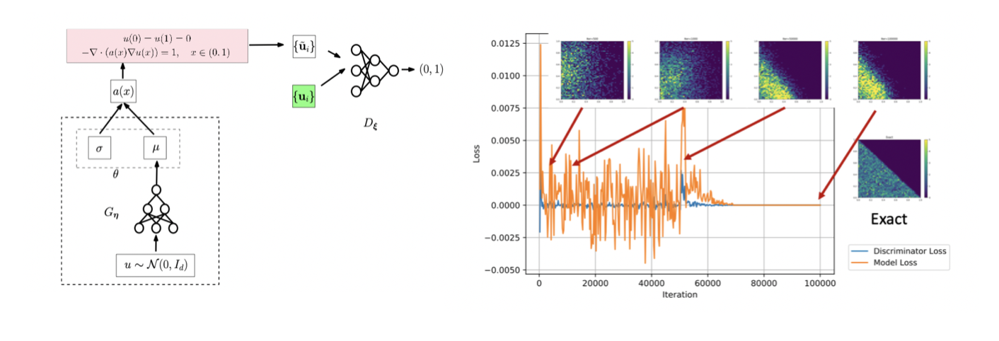
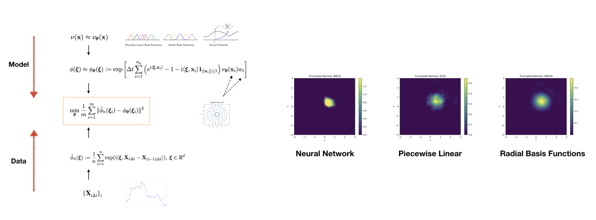
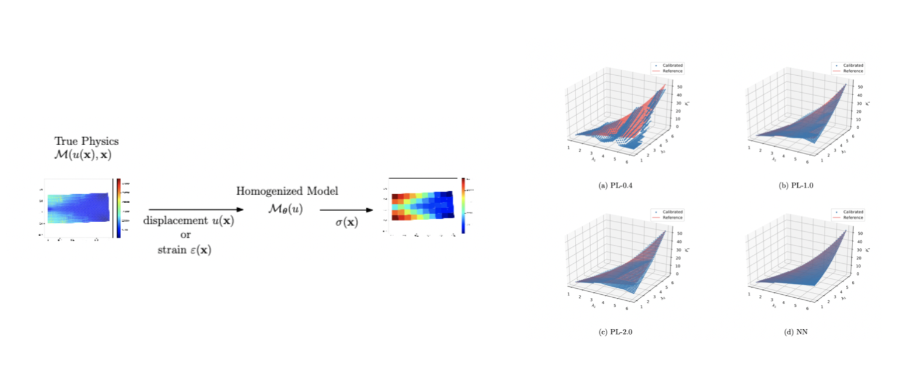

# Adversarial Numerical Analysis

---

Kailai Xu, and Eric Darve. "[Adversarial Numerical Analysis for Inverse Problems](https://arxiv.org/abs/1910.06936)"

---

Many scientific and engineering applications are formulated as inverse problems associated with stochastic models. In such cases the unknown quantities are distributions. The applicability of traditional methods is limited because of their demanding assumptions or prohibitive computational consumptions; for example, maximum likelihood methods require closed-form density functions, and Markov Chain Monte Carlo needs a large number of simulations. 

Consider the forward model

``x = F(w, \theta)``

Here $w$ is a known stochastic process such as Gaussian processes, $\theta$ is an unknown parameter, distribution or stochastic processes. Consequently, the output of the model $x$ is also a stochastic process. $F$ can be a very complicated model such as a system of partial differential equations. Many models fall into this category, but here we consider a simple case:

``\begin{cases}
    -\nabla \cdot (a(x)\nabla u(x)) = 1 & x\in(0,1)\\\\
    u(0) = u(1) = 0 & \mbox{otherwise}
\end{cases}``

``a(x) = 1-0.9\exp\left( -\frac{(x-\mu)^2}{2\sigma^2} \right)``

Here ($\mu$, $\sigma$) is subject to unknown distribution ($\theta$ in the forward model). $w=\emptyset$ and $x$ is the solution to the equation, $u$. Assume we have observed a set of solutions $u_i$, and we want to estimate the distribution of ($\mu$, $\sigma$). Adversarial numerical analysis works as follows

1. The distribution ($\mu$, $\sigma$) is parametrized by a deep neural network $G_{\eta}$.

2. For each instance of ($\mu$, $\sigma$) sampled from the neural network parametrized distribution, we can compute a solution $u_{\mu, \sigma}$ using the finite difference method. 

3. We compute a metric between the *distribution* $u_{\mu, \sigma}$ and $u_i$ with a discriminative neural network $D_{\xi}$.

4. Minimize the metric by adjusting the weights of $G_{\eta}$ and $D_{\xi}$. 

The distribution of ($\mu$, $\sigma$) is given by $G_{\eta}$. The following plots show the workflow of adversarial numerical analysis and a sample result for the Dirichlet distribution. 

# Calibrating Multivariate Lévy Processes with Neural Networks

---

Kailai Xu and Eric Darve. "[Calibrating Multivariate Lévy Processes with Neural Networks](https://arxiv.org/abs/1812.08883)"

---

Calibrating a Lévy process usually requires characterizing its jump distribution. Traditionally this problem can be solved with nonparametric estimation using the empirical characteristic functions (ECF), assuming certain regularity, and results to date are mostly in 1D. For multivariate Lévy processes and less smooth Lévy densities, the problem becomes challenging as ECFs decay slowly and have large uncertainty because of limited observations. We solve this problem by approximating the Lévy density with a parametrized functional form; the characteristic function is then estimated using numerical integration. In our benchmarks, we used deep neural networks and found that they are robust and can capture sharp transitions in the Lévy density. They perform favorably compared to piecewise linear functions and radial basis functions. The methods and techniques developed here apply to many other problems that involve nonparametric estimation of functions embedded in a system model.

The Lévy process can be described by the Lévy-Khintchine formula

``\phi({\xi}) = \mathbb{E}[e^{\mathrm{i} \langle {\xi}, \mathbf{X}_t \rangle}] =\exp\left[t\left( \mathrm{i} \langle \mathbf{b}, {\xi} \rangle - \frac{1}{2}\langle {\xi}, \mathbf{A}{\xi}\rangle  +\int_{\mathbb{R}^d} \left( e^{\mathrm{i} \langle {\xi}, \mathbf{x}\rangle} - 1 - \mathrm{i} \langle {\xi}, \mathbf{x}\rangle \mathbf{1}_{\|\mathbf{x}\|\leq 1}\right)\nu(d\mathbf{x})\right) \right]``

Here the multivariate L\'evy process is described by three parameters: a positive semi-definite matrix $\\mathbf{A} = {\Sigma}{\Sigma}^T \in \mathbb{R}^{d\times d}$, where ${\Sigma}\in \mathbb{R}^{d\times d}$, a vector $\mathbf{b}\in \mathbb{R}^d$ and a measure $\nu\in \mathbb{R}^d\backslash\{\mathbf{0}\}$. 

Given a sample path $\mathbf{X}_{i\Delta t}$, $i=1,2,3,\ldots$, we focus on estimating $\mathbf{b}$, $\mathbf{A}$ and $\nu$. In this work, we focus on the functional inverse problem--estimate $\nu$--and assume $\mathbf{b}=0,\mathbf{A}=0$. The idea is

* The L\'evy density is approximated by a parametric functional form---such as piecewise linear functions---with parameters $\theta$,
``
    \nu(\mathbf{x}) \approx \nu_{\theta}(\mathbf{x})
``
* The characteristic function is approximated by numerical integration 
``\phi({\xi})\approx    \phi_{\theta}({\xi}) := \exp\left[ \Delta t \sum_{i=1}^{n_q} \left(e^{\mathrm{i} \langle{\xi}, \mathbf{x}_i \rangle}-1-\mathrm{i}\langle{\xi}, \mathbf{x}_i \rangle\mathbf{1}_{\|\mathbf{x}_i\|\leq 1}  \right)\nu_{\theta}(\mathbf{x}_i) w_i \right]``
where $\{(\mathbf{x}_i, w_i)\}_{i=1}^{n_q}$ are quadrature nodes and weights.

* The empirical characteristic functions are computed given observations $\{\mathbf{X}_{i\Delta t}\}_{i=0}^n$

``\hat\phi_n({\xi}) := \frac{1}{n}\sum_{i=1}^n \exp(\mathrm{i}\langle {\xi}, \mathbf{X}_{i\Delta t}-\mathbf{X}_{(i-1)\Delta t}\rangle ),\  {\xi} \in \mathbb{R}^d ``

* Solve the following optimization problem with a gradient based method. Here $\{{\xi}_i \}_{i=1}^m$ are collocation points depending on the data. 
`` \min_{\theta}\frac{1}{m} \sum_{i=1}^m \|\hat\phi_n({\xi}_i)-\phi_{\theta}({\xi}_i)  \|^2``

We show the schematic description of the method and some results on calibrating a discontinuous Lévy density function $\nu$. 

# Learning Constitutive Relations from Indirect Observations Using Deep Neural Networks

---

Kailai Xu (**co-first author**), Huang, Daniel Z. (**co-first author**), Charbel Farhat, and Eric Darve. "[Learning Constitutive Relations from Indirect Observations Using Deep Neural Networks](https://arxiv.org/abs/1905.12530)"

---

We present a new approach for predictive modeling and its uncertainty quantification for mechanical systems, where coarse-grained models such as constitutive relations are derived directly from observation data. We explore the use of neural networks to represent the unknowns functions (e.g., constitutive relations). Its counterparts, like piecewise linear functions and radial basis functions, are compared, and the strength of neural networks is explored. The training and predictive processes in this framework seamlessly combine the finite element method, automatic differentiation, and neural networks (or its counterparts). Under mild assumptions, we establish convergence guarantees. This framework also allows uncertainty quantification analysis in the form of intervals of confidence. Numerical examples on a multiscale fiber-reinforced plate problem and a nonlinear rubbery membrane problem from solid mechanics demonstrate the effectiveness of the framework.

The solid mechanics equation can be formulated as

``\mathcal{P}(u(\mathbf{x}), \mathcal{M}(u(\mathbf{x}),\dot u(\mathbf{x}) \mathbf{x})) = \mathcal{F}(u(\mathbf{x}), \mathbf{x}, p)``

where $u$ is the displacement, $\mathbf{x}$ is the location, $p$ is the external pressure, $\mathcal{F}$ is the external force, $\mathcal{M}(u(\mathbf{x}),\dot u(\mathbf{x}) \mathbf{x})$ is the stress ($\mathcal{M}$ is also called the constitutive law), $\mathcal{P}(u(\mathbf{x}), \mathcal{M}(u(\mathbf{x}),\dot u(\mathbf{x}) \mathbf{x}))$ is the internal force. For a new material or nonhomogeneous material, the constitutive relation $\mathcal{M}$ is not known and we want to estimate it. In laboratory, usually only $u(\mathbf{x})$ can be measured but the stress cannot. The idea is to substitute the constitutive law relation--in this work, we assume $\mathcal{M}$ only depends on $u(\mathbf{x})$ and the neural network is $\mathcal{M}_{\theta}(u(\mathbf{x}))$, where $\theta$ is the unknown parameter. 

We train the neural network by minimizing

``\|\mathcal{P}(\mathbf{u}, \mathcal{M}_{\theta}(\mathbf{u})) - \mathcal{F}(\mathbf{u}, \mathbf{x}, p) \|``

