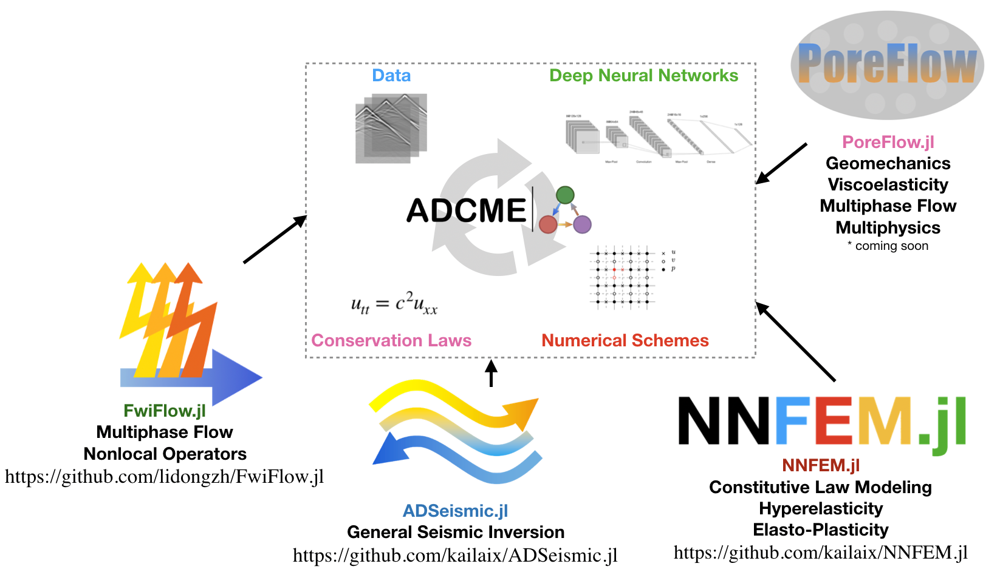

# Overview

ADCME is suitable for conducting inverse modeling in scientific computing. The purpose of the package is to: (1) provide differentiable programming framework for scientific computing based on TensorFlow automatic differentiation (AD) backend; (2) adapt syntax to facilitate implementing scientific computing, particularly for numerical PDE discretization schemes; (3) supply missing functionalities in the backend (TensorFlow) that are important for engineering, such as sparse linear algebra, constrained optimization, etc. Applications include

- full wavelength inversion

- constitutive modeling in solid mechanics

- learning hidden geophysical dynamics

- physics based machine learning

- parameter estimation in stochastic processes

The package inherents the scalability and efficiency from the well-optimized backend TensorFlow. Meanwhile, it provides access to incooperate existing C/C++ codes via the custom operators. For example, some functionalities for sparse matrices are implemented in this way and serve as extendable "plugins" for ADCME. 



Read more about the methodology, the philosophy, the insights and the perspective about ADCME: [slides](./assets/Slide/ADCME.pdf). Start with [tutorial](./tutorial.md) to solve your own inverse modeling problems.

**Installation**

It is recommended to install ADCME via
```julia
using Pkg; Pkg.add("ADCME")
```

Make sure to run the ADCME doctor to check the health of your ADCME installation.

```
using ADCME
doctor()
```

However, in some cases, you may want to install the package and configure the environment manually. 

Step 1: Install `ADCME` on a computer with Internet access and zip all files from the following paths

```julia
julia> using Pkg
julia> Pkg.depots()
```

The files will contain all the dependencies. 

Step 2: Build `ADCME` mannually. 

```julia
using Pkg;
ENV["manual"] = 1
Pkg.build("ADCME")
```

However, in this case you are responsible for configuring the environment by modifying the file

```julia
using ADCME; 
print(joinpath(splitdir(pathof(ADCME))[1], "deps/deps.jl"))
```

**Quick Overview**

Let's consider a simple problem: we want to solve the unconstrained optimization problem

$$f(\mathbf{x}) = \sum_{i=1}^{n-1}\left[ 100(x_{i+1}-x_i^2) + (1-x_i)^2 \right]$$

where $x_i\in [-10,10]$ and $n=100$. 

We solve the problem using the L-BFGS-B method. 

```julia
using ADCME
n = 100
x = Variable(rand(n)) # Use `Variable` to mark the quantity that gets updated in optimization
f = sum(100((x[2:end]-x[1:end-1])^2 + (1-x[1:end-1])^2)) # Use typical Julia syntax 
sess = Session(); init(sess) # Create and initialize a session is mandatory for activating the computational graph
BFGS!(sess, f, var_to_bounds = Dict(x=>[-10.,10.]))
```

To get the value of $\mathbf{x}$, we use [`run`](@ref) to extract the values 

```julia
run(sess, x)
```

The above command will return a value close to  the optimal values $\mathbf{x} = [1\ 1\ \ldots\ 1]$. 

**Do you know...**

You can also use ADCME to do typical machine learning tasks and leverage the Julia machine learning ecosystem! Here is an example of training a ResNet for digital number recognition.

```julia
using MLDatasets
using ADCME

# load data 
train_x, train_y = MNIST.traindata()
train_x = reshape(Float64.(train_x), :, size(train_x,3))'|>Array
test_x, test_y = MNIST.testdata()
test_x = reshape(Float64.(test_x), :, size(test_x,3))'|>Array

# construct loss function 
ADCME.options.training.training = placeholder(true)
x = placeholder(rand(64, 784))
l = placeholder(rand(Int64, 64))
resnet = Resnet1D(10, num_blocks=10)
y = resnet(x)
loss = mean(sparse_softmax_cross_entropy_with_logits(labels=l, logits=y))

# train the neural network 
opt = AdamOptimizer().minimize(loss)
sess = Session(); init(sess)
for i = 1:10000
    idx = rand(1:60000, 64)
    _, loss_ = run(sess, [opt, loss], feed_dict=Dict(l=>train_y[idx], x=>train_x[idx,:]))
    @info i, loss_
end

# test 
for i = 1:10
    idx = rand(1:10000,100)
    y0 = resnet(test_x[idx,:])
    y0 = run(sess, y0, ADCME.options.training.training=>false)
    pred = [x[2]-1 for x in argmax(y0, dims=2)]
    @info "Accuracy = ", sum(pred .== test_y[idx])/100
end
```


**Contributing**

Contribution and suggestions are always welcome. In addition, we are also looking for research collaborations. You can submit issues for suggestions, questions, bugs, and feature requests, or submit pull requests to contribute directly. You can also contact the authors for research collaboration. 
