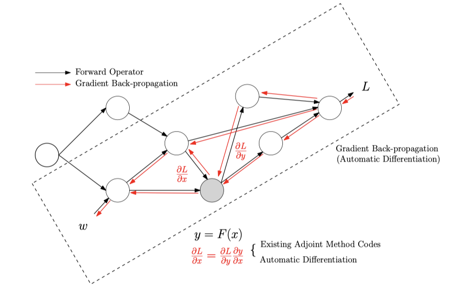

# Overview

ADCME is suitable for conducting inverse modeling in scientific computing. The purpose of the package is to: (1) provide differentiable programming framework for scientific computing based on TensorFlow automatic differentiation (AD) backend; (2) adapt syntax to facilitate implementing scientific computing, particularly for numerical PDE discretization schemes; (3) supply missing functionalities in the backend (TensorFlow) that are important for engineering, such as sparse linear algebra, constrained optimization, etc. Applications include

- full wavelength inversion

- constitutive modeling in solid mechanics

- learning hidden geophysical dynamics

- physics based machine learning

- parameter estimation in stochastic processes

The package inherents the scalability and efficiency from the well-optimized backend TensorFlow. Meanwhile, it provides access to incooperate existing C/C++ codes via the custom operators. For example, some functionalities for sparse matrices are implemented in this way and serve as extendable "plugins" for ADCME. 



Read more about the methodology, the philosophy, the insights and the perspective about ADCME: [slides](./assets/Slide/ADCME.pdf). Start with [tutorial](./tutorial.md) to solve your own inverse modeling problems.

**Installation**

It is recommended to install ADCME via
```julia
using Pkg; Pkg.add("ADCME")
```

However, in some cases, you may want to install the package and configure the environment manually. 

Step 1: Install `ADCME` on a computer with Internet access and zip all files from the following paths

```julia
julia> using Pkg
julia> Pkg.depots()
```

The files will contain all the dependencies. 

Step 2: Build `ADCME` mannually. 

```julia
using Pkg;
ENV["manual"] = 1
Pkg.build("ADCME")
```

However, in this case you are responsible for configuring the environment by modifying the file

```julia
using ADCME; 
print(joinpath(splitdir(pathof(ADCME))[1], "deps/deps.jl"))
```

