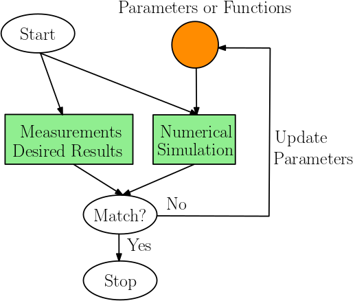

# Inverse Modeling

**Inverse modeling** (IM) identifies a certain set of parameters or functions with which the outputs of the _forward model_ matches the desired result or measurement. IM can usually be solved by formulating it as an optimization problem. But the major difference is that IM aims at getting information not accessible to forward model, instead of obtaining an optimal value of a fixed objective function and set of constraints. In practice, the objective function and constraints can be adjusted and prior information of the unknown parameters or functions can be imposed in the form of regularizers to better reflect the physical laws. 

The inverse modeling problem can be mathematically formulated as finding an unknown parameter $\theta$ given input $x = \hat x$ and output $y = \hat y$ of a forward model
```math
y = F(x, \theta)
```
Here $x$ and $y$ can be a sample from a stochastic process. The scope of inverse problems that can be tackled with ADCME is

1. The forward model must be _differentiable_,  i.e., $\frac{\partial F}{\partial x}$ and $\frac{\partial F}{\partial \theta}$ exist. However, we do not require those gradients to be implemented by users; they can be computed with automatic differentiation in ADCME.
2. The forward model must be a _white-box_ and implemented with ADCME. ADCME is not for inverse modeling of black-box models. 

One iterative process for estimating $\theta$ works as follows: we start from an initial guess $\theta = \hat \theta_0$, assuming it is correct, and compute the predicted output $\hat y_0$ with the forward modeling codes implemented in ADCME. Then, we measure the discrepancy between the predicted output $\hat y_0$ and $\hat y$ and apply the regular gradient-based optimization method to find the optimal $\theta$ that minimizes this discrepancy. The gradients are computed with automatic differentiation, adjoint state methods or both. 

This conceptually simple approach can solve various types of inverse problems: either $x$, $y$ are stochastic or deterministic and the unknown $\theta$ can  be a value, function and even functionals. As an example, assume the forward model is Poisson equation $\nabla \cdot (\theta\nabla y(\mathbf{x})) = 0$ with appropriate boundary condition ($x$), $y(\mathbf{x})$ is the output ($\mathbf{x}$ is the coordinate, not $x$) , the following is four kinds of potential classes of problems solvable with ADCME

| **Inverse problem**                          | **Problem type**     | **Approach**                    |             **Reference**             |
| ---------------------------------------- | -------------------- | ------------------------------- | :-----------------------------------: |
| $\nabla\cdot(c\nabla u) = 0$             | Parameter            | Adjoint State Method            |                 [1]()                 |
| $\nabla\cdot(f(\mathbf{x})\nabla u) = 0$ | Function             | DNN                             | [2](https://arxiv.org/abs/1901.07758) |
| $\nabla\cdot(f(u)\nabla u) = 0$          | Functional           | DNN Learning from indirect data | [3](https://arxiv.org/abs/1905.12530) |
| $\nabla\cdot(\varpi\nabla u) = 0$        | Stochastic Inversion | Adversarial Learning with GAN   | [4](https://arxiv.org/abs/1910.06936) |





## Automatic Differentiation

One powerful tool in inverse modeling is automatic differentiation (AD). Automatic differentiation is a general way to compute gradients based on the chain rule. By tracing the forward-pass computation, the gradient at the final step can propagate back to every operator and every parameter in a computational graph. 

As an example, a neural network model mainly consists of a sequence of linear transforms and non-linear activation functions. The goal of the training process is to minimize the error between its prediction and the label of ground truth. Automatic differentiation is used to calculate the gradients of every variable by back-propagating the gradients from the loss function to the trainable parameters, i.e., the weights and biases of neural networks. The gradients are then used in a gradient-based optimizer such as gradient descent methods to update the parameters. 

For another example, the physical forward simulation is similar to the neural network model in that they are both sequences of linear/non-linear transforms. One popular method in physical simulation, the FDTD (Finite-Difference Time-Domain) method, applies a finite difference operator to a consecutive time steps to solve time-dependent partial differential equations (PDEs). In seismic problems, we can specify parameters such as earthquake source functions and earth media properties to simulate the received seismic signals. In seismic inversion problems, those parameters are unknown and we can invert the underlining source characteristic and media property by minimizing the difference between the simulated seismic signals and the observed ones. In the framework of automatic differentiation, the gradients of the difference can be computed automatically and thus used in a gradient-based optimizer. 


## AD Implementation in ADCME

ADCME uses TensorFlow as the backend for automatic differentiation. However, one major difference of ADCME compared with TensorFlow is that it provides a friendly syntax for scientific computing (essentially the same syntax as native Julia). This substantially reduces development time. In addition, ADCME augments TensorFlow libraries by adding missing features that are useful for scientific computing, such as sparse matrix solve, sparse least square, sparse assembling, etc. Additionally, Julia interfaces make it possible for directly implementing efficient numerical computation parts of the simulation (requires no automatic differentiation), for interacting with other languages (MATLAB, C/C++, R, etc.) and for built-in Julia parallelism. 

As an example, we show how a convoluted acoustic wave equation simulation with PML boundary condition can be translated to Julia codes with AD feature very neatly. 


## Forward Operator Types

All numerical simulations can be decomposed into operators that are chained together. These operators range from a simple arithmetic operation such as addition or multiplication, to more sophisticated computation such as solving a linear system. Automatic differentiation relies on the differentiation of those operators and integrates them with chain rules. Therefore, it is very important for us to study the basic types of existing operators. 


In this tutorial, a operator is defined as a numerical procedure that accepts a parameter called **input**, $x$, and turns out a parameter called **ouput**, $y=f(x)$. For reverse mode automatic differentiation, besides evaluating $f(x)$, we need also to compute $\frac{\partial J}{\partial x}$ given $\frac{\partial J}{\partial y}$ where $J$ is a functional of $y$. 


Note  the operator $y=f(x)$ may be implicit in the sense that $f$ is not given directly. In general, we can write the relationship between $x$ and $y$ as $F(x,y)=0$. The operator is **well-defined** if for given $x$, there exists one and only one $y$ such that $F(x,y)=0$. 


For automatic differentiation, besides the well-definedness of $F$, we also require that we can compute $\frac{\partial J}{\partial x}$ given $\frac{\partial J}{\partial y}$. It is easy to see that

```math
\frac{\partial J}{\partial x} = -\frac{\partial J}{\partial y}F_y^{-1}F_x
```
Therefore, we call an operator $F$ is **well-posed** if $F_y^{-1}$ exists. 

All operators can be classified into four types based on the linearity and explicitness.


**Linear and explicit**


This type of operators has the form 
```math
y = Ax
```
where $A$ is a matrix. In this case, 
```math
F(x,y) = Ax-y
```
and therefore 
```math
\frac{\partial J}{\partial x} = \frac{\partial J}{\partial y}A
```
In Tensorflow, such an operator can be implemented as (assuming `A` is )
```python
import tensorflow as tf
@tf.custom_gradient
def F(x):
      u = tf.linalg.matvec(A, x)
      def grad(dy):
          return tf.linalg.matvec(tf.transpose(A), dy)
      return u, grad
```


**Nonlinear and explicit**

In this case, we have 
```math
y = F(x)
```
where $F$ is explicitly given. We have
```math
F(x,y) = F(x)-y\Rightarrow \frac{\partial J}{\partial x} = \frac{\partial J}{\partial y} F_x(x)
```


One challenge here is we need to implement the matrix vector production $\frac{\partial J}{\partial y} F_x(x)$ for `grad`. 


**Linear and implicit**

In this case 
```math
Ay = x
```
We have $F(x,y) = x-Ay$ and 
```math
\frac{\partial J}{\partial x} = \frac{\partial J}{\partial y}A^{-1}
```


**Nonlinear and implicit**

In this case $F(x,y)=0$ and the corresponding gradient is 
```math
\frac{\partial J}{\partial x} = -\frac{\partial J}{\partial y}F_y^{-1}F_x
```
This case is the most challenging of the four but widely seen in scientific computing code. In many numerical simulation code, $F_y$ is usually sparse and therefore it is rewarding to exploit the sparse structure for computation acceleration in practice.


## Related Algorithms


### EM Algorithm

We now split the parameter $\theta=(\theta_1, \theta_2)$, i.e., the inverse model is

```math
y = F(x, (\theta_1, \theta_2))
```

The expectation maximization algorithm alternates between the steps of guessing a probability distribution of a certain unknown $\theta_1$ (E-Step) given current $\theta_2$  and then re-estimating the other unknown $\theta_2$ (M-Step) assuming the guess $\theta_1$ is true. The name "expectation" comes from the fact that usually the optimal guess is the expectation over a probability distribution. The algorithm is as follows


$\begin{aligned}
\theta_2^{(0)} &= \arg\min_{\theta_2} D_1(\hat y, F(\hat x; \theta_1^{(0)}, \theta_2))\\
\theta_1^{(1)} &= \arg\min_{\theta_1} D_2(\hat y, F(\hat x; \theta_1, \theta_2^{(0)}))\\
\theta_2^{(1)} &= \arg\min_{\theta_2} D_1(\hat y, F(\hat x; \theta_1^{(1)}, \theta_2))\\
\theta_1^{(2)} &= \arg\min_{\theta_1} D_1(\hat y, F(\hat x; \theta_1, \theta_2^{(1)}))\\
\ldots
\end{aligned}$

Recall that $\hat x$ and $\hat y$ represent observations (can be stochastic). $D_1$ and $D_2$ are discrepancy metrics, such as KL divergence. We immediately recognize EM algorithm as a coordinate descent method when $D_1=D_2$. 