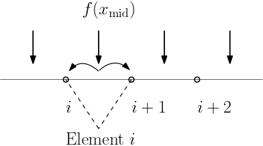

# ADCME Tutorial

> The Gateway to Inverse Modeling with Physics Based Machine Learning

**Overview**

ADCME is an open-source Julia package for inverse modeling in scientific computing using automatic differentiation. The backend of ADCME is the high performance deep learning framework, TensorFlow, which provides parallel computing and automatic differentiation features based on computational graph, but  ADCME augments TensorFlow by functionalities---like sparse linear algebra---essential for scientific computing. ADCME leverages the Julia environment for maximum efficiency of computing. Additionally, the syntax of ADCME is designed from the beginning to be compatible with the Julia syntax, which is friendly for scientific computing. 

**Prerequisites**

The tutorial does not assume readers with experience in deep learning. However, basic knowledge of scientific computing in Julia is required. 

**Tutorial Series**

[What is ADCME? Computational Graph, Automatic Differentiation & TensorFlow]("What is ADCME? Computational Graph, Automatic Differentiation & TensorFlow")

ADCME Basics: Tensor, Type, Operator, Session & Kernel

Mathematical Minimization with ADCME

Sparse Linear Algebra in ADCME

Numerical Scheme in ADCME: Finite Difference Example

Numerical Scheme in ADCME: Finite Element Example

Inverse Modeling in ADCME

Neural Network Tutorial: Combining NN with Numerical Schemes 

Advanced: Automatic Differentiation for Implicit Operations 

Advanced: Custom Operators 

Advanced: Debugging 

## What is ADCME? Computational Graph, Automatic Differentiation & TensorFlow

### Computational Graph	

A computational graph is a functional description of the required computation. In the computationall graph, an edge represents a value, such as a scalar, a vector, a matrix or a tensor. A node represents a function whose input arguments are the the incoming edges and output values are are the outcoming edges. Based on the number of input arguments, a function can be nullary, unary, binary, ..., and n-ary; based on the number of output arguments, a function can be single-valued or multiple-valued. 


Computational graphs are directed and acyclic. The acyclicity implies the forward propagation computation is well-defined: we loop over edges in topological order and evaluates the outcoming edges for each node. To make the discussion more concrete, we illustrate the computational graph for 

$$z = \sin(x_1+x_2) + x_2^2 x_3$$


There are in general two programmatic ways to construct computational graphs: static and dynamic declaration. In the static declaration, the computational graph is first constructed symbolically, i.e., no actual numerical arithmetic are executed. Then a bunch of data is fed to the graph for the actual computation. An advantage of static declarations is that they allow for graph optimization such as removing unused branches. Additionally, the dependencies can be analyzed for parallel execution of independent components. Another approach is the dynamic declaration, where the computational graph is constructed on-the-fly as the forward computation is executed. The dynamic declaration interleaves construction and evaluation of the graph, making software development more intuitive. 

### Automatic Differentiation

(This section can be skipped in the first reading.)

An important application of computational graphs is automatic differentiation (AD). In general, there are three modes of AD: reverse-mode, forward-mode, and mixed mode. In this tutorial, we focus on the reverse-mode, which computes the gradients with respect to independent variables by backward propagation, i.e., loop over the edges in reverse topological order starting with a final goal edge. 


To explain how reverse-mode AD works, let's consider constructing a computational graph with independent variables 

$$\{x_1, x_2, \ldots, x_n\}$$

and the forward propagation produces a single output $x_N$, $N>n$. The gradients $\frac{\partial x_N(x_1, x_2, \ldots, x_n)}{\partial x_i}$
$i=1$, $2$, $\ldots$, $n$ are queried. 

The idea is that this algorithm can be decomposed into a sequence of functions $f_i$ ($i=n+1, n+2, \ldots, N$) that can be easily differentiated analytically, such as addition, multiplication, or basic functions like exponential, logarithm and trigonometric functions. Mathematically, we can formulate it as

$$\begin{aligned}
    x_{n+1} &= f_{n+1}(\mathbf{x}_{\pi({n+1})})\\
    x_{n+2} &= f_{n+2}(\mathbf{x}_{\pi({n+2})})\\
    \ldots\\
    x_{N} &= f_{N}(\mathbf{x}_{\pi({N})})\\
\end{aligned}$$

where $\mathbf{x} = \{x_i\}_{i=1}^N$ and $\pi(i)$ are the parents of $x_i$, s.t., $\pi(i) \in \{1,2,\ldots,i-1\}$.


The idea to compute $\partial x_N / \partial x_i$ is to start from $i = N$, and establish recurrences to calculate derivatives with respect to $x_i$ in terms of derivatives with respect to $x_j$, $j >i$. To define these recurrences rigorously, we need to define different functions that differ by the choice of independent variables.

The starting point is to define $x_i$ considering all previous $x_j$, $j < i$, as independent variables. Then:

$$x_i(x_1, x_2, \ldots, x_{i-1}) = f_i(\mathbf{x}_{\pi(i)})$$

Next, we observe that $x_{i-1}$ is a function of previous $x_j$, $j < i-1$, and so on; so that we can recursively define $x_i$ in terms of fewer independent variables, say in terms of $x_1$, ..., $x_k$, with $k < i-1$. This is done recursively using the following definition:

$$x_i(x_1, x_2, \ldots, x_j) = x_i(x_1, x_2, \ldots, x_j, f_{j+1}(\mathbf{x}_{\pi(j+1)})), \quad n < j+1 < i$$

Observe that the function of the left-hand side has $j$ arguments, while the function on the right has $j+1$ arguments. This equation is used to "reduce" the number of arguments in $x_i$.

With these definitions, we can define recurrences for our partial derivatives which form the basis of the back-propagation algorithm. The partial derivatives for

$$x_N(x_1, x_2, \ldots, x_{N-1})$$

are readily available since we can differentiate

$$f_N(\mathbf{x}_{\pi(N)})$$

directly. The problem is therefore to calculate partial derivatives for functions of the type $x_N(x_1, x_2, \ldots, x_i)$ with $i<N-1$. This is done using the following recurrence:

$$\frac{\partial x_N(x_1, x_2, \ldots, x_{i})}{\partial x_i} = \sum_{j\,:\,i\in \pi(j)}
    \frac{\partial x_N(x_1, x_2, \ldots, x_j)}{\partial x_j}
    \frac{\partial x_j(x_1, x_2, \ldots, x_{j-1})}{\partial x_i}$$

with $n < i< N-1$. Since $i \in \pi(j)$, we have $i < j$. So we are defining derivatives with respect to $x_i$ in terms of derivatives with respect to $x_j$ with $j > i$. The last term

$$\frac{\partial x_j(x_1, x_2, \ldots, x_{j-1})}{\partial x_k}$$

is readily available since:

$$x_j(x_1, x_2, \ldots, x_{j-1}) = f_j(\mathbf{x}_{\pi(j)})$$


The computational cost of this recurrence is proportional to the number of edges in the computational graph (excluding the nodes $1$ through $n$), assuming that the cost of differentiating $f_k$ is $O(1)$. The last step is defining

$$\frac{\partial x_N(x_1, x_2, \ldots, x_n)}{\partial x_i} = \sum_{j\,:\,i\in \pi(j)}
    \frac{\partial x_N(x_1, x_2, \ldots, x_j)}{\partial x_j}
    \frac{\partial x_j(x_1, x_2, \ldots, x_{j-1})}{\partial x_i}$$

with $1 \le i \le n$. Since $n < j$, the first term

$$\frac{\partial x_N(x_1, x_2, \ldots, x_j)}{\partial x_j}$$

has already been computed in earlier steps of the algorithm. The computational cost is equal to the number of edges connected to one of the nodes in $\{1, \dots, n\}$.

We can see that the complexity of the back-propagation is bounded by that of the forward step, up to a constant factor. Reverse mode differentiation is very useful in the penalty method, where the loss function is a scalar, and no other constraints are present. 

As a concrete example, we consider the example of evaluating $\frac{dz(x_1,x_2,x_3)}{dx_i}$, where $z = \sin(x_1+x_2) + x_2^2x_3$. The gradients are  backward propagated exactly in the reverse order of the forward propagation. 


### TensorFlow

Google's TensorFlow provides a convenient way to specify the computational graph statically. TensorFlow  has automatic differentiation features and its performance is optimized for large-scale computing. ADCME is built on TensorFlow by overloading numerical operators and augmenting TensorFlow with essential scientific computing functionalities. We contrast the TensorFlow implementation with the ADCME implementation of computing the objective function and its gradient in the following example.

$$y(x) = \|(AA^T+xI)^{-1}b-c\|^2, \; z = y'(x)$$ 

where $A\in \mathbb{R}^{n\times n}$ is a random matrix, $x,b,c$ are scalars, and $n=10$.

**TensorFlow Implementation**

```python
import tensorflow as tf
import numpy as np 
A = tf.constant(np.random.rand(10,10), dtype=tf.float64)
x = tf.constant(1.0, dtype=tf.float64)
b = tf.constant(np.random.rand(10), dtype=tf.float64)
c = tf.constant(np.random.rand(10), dtype=tf.float64)
B = tf.matmul(A, tf.transpose(A)) + x * tf.constant(np.identity(10))
y = tf.reduce_sum((tf.squeeze(tf.matrix_solve(B, tf.reshape(b, (-1,1))))-c)**2)
z = tf.gradients(y, x)[0]
sess = tf.Session()
sess.run([y, z])
```

**Julia Implementation**

```julia
using ADCME, LinearAlgebra
A = constant(rand(10,10))
x = constant(1.0)
b = rand(10)
c = rand(10)
y = sum(((A*A'+x*diagm(0=>ones(10)))\b - c)^2)
z = gradients(y, x)
sess = Session()
run(sess, [y,z])
```


### Summary

The computational graph and automatic differentiation are the core concepts underlying ADCME. TensorFlow works as the workhorse for optimion and execution of the computational graph in a high performance environment. 

To construct a computational graph for a Julia program, ADCME overloads most numerical operators like `+`, `-`, `*`, `/` and matrix multiplication in Julia by the corresponding TensorFlow operators. Therefore, you will find many similar workflows and concepts as TensorFlow, such as `constant`, `Variable`, `session`, etc. However, not all operators relevant to scientific computing in Julia have its counterparts in TensorFlow. To that end, custom kernels are implemented to supplement TensorFlow, such as sparse linear algebra related functions. 

ADCME aims at providing a easy-to-use, flexible,  and high performance interface to do data processing, implement numerical schemes, and conduct mathematical optimization. It is built not only for academic interest but also for real-life large-scale simulations. 

Like TensorFlow, ADCME works in sessions, in which each session consumes a computational graph. Usually the workflow is split into three steps:

1. Define independent variables. `constant` for tensors that do not require gradients and `Variable` for those requiring gradients. 

   ```julia
   a = constant(0.0)
   ```

2. Construct the computational graph by defining the computation

   ```julia
   L = (a-1)^2
   ```

3. Create a session and run the computational graph

   ```julia
   sess = Session()
   run(sess, L)
   ```

   


## ADCME Basics: Tensor, Type, Operator, Session & Kernel

### Tensors and Operators

`Tensor` is a data structure for storing structured data, such as a scalar, a vector, a matrix or a high dimensional tensor. The name of the ADCME backend, `TensorFlow`, is also derived from its core framework, `Tensor`. Tensors can be viewed as symbolic versions of Julia's `Array`. 


A tensor is a collection of $n$-dimensional arrays. ADCME represents tensors using a `PyObject` handle to the TensorFlow `Tensor` data structure. A tensor has three important properties

- `name`: Each Tensor admits a unique name. 
- `shape`: For scalars, the shape is always an empty tuple `()`; for $n$-dimensional vectors, the shape is `(n,)`; for matrices or higher order tensors, the shape has the form `(n1, n2, ...)`
- `dtype`: The type of the tensors. There is a one-to-one correspondence between most TensorFlow types and Julia types (e.g., `Int64`, `Int32`, `Float64`, `Float32`, `String`, and `Bool`). Therefore, we have overloaded the type name so users have a unified interface. 


An important difference is that `tensor` object stores data in the row-major while Julia's default for `Array` is column major. The difference may affect performance if not carefully dealt with, but more often than not, the difference is not relevant if you do not convert data between Julia and Python often. Here is a representation of ADCME `tensor`


There are 4 ways to create tensors. 

- [`constant`](@ref). As the name suggests, `constant` creates an immutable tensor from Julia Arrays. 

```julia
constant(1.0)
constant(rand(10))
constant(rand(10,10))
```

- [`Variable`](@ref). In contrast to `constant`, `Variable` creates tensors that are mutable. The mutability allows us to update the tensor values, e.g., in an optimization procedure. It is very important to understand the difference between `constant` and `Variable`: simply put, in inverse modeling, tensors that are defined as `Variable` should be the quantity you want to invert, while `constant` is a way to provide known data.

```julia
Variable(1.0)
Variable(rand(10))
Variable(rand(10,10))
```

- [`placeholder`](@ref). `placeholder` is a convenient way to specify a tensor whose values are to be provided in the runtime. One use case is that you want to try out different values for this tensor and scrutinize the simulation result. 

```julia
placeholder(Float64, shape=[10,10])
placeholder(rand(10)) # default value is `rand(10)`
```

- [`SparseTensor`](@ref). `SparseTensor` is a special data structure to store a sparse matrix. Although it is not very emphasized in machine learning, sparse linear algebra is one of the cores to scientific computing. Thus possessing a strong sparse linear algebra support is the key to success inverse modeling with physics based machine learning. 

```julia
using SparseArrays
SparseTensor(sprand(10,10,0.3))
SparseTensor([1,2,3],[2,2,2],[0.1,0.3,0.5],3,3) # specify row, col, value, number of rows, number of columns
```


Now we know how to create tensors, the next step is to perform mathematical operations on those tensors.

`Operator` can be viewed as a function that takes multiple tensors and outputs multiple tensors. In the computational graph, operators are represented by nodes while tensors are represented by edges. Most mathematical operators, such as `+`, `-`, `*` and `/`, and matrix operators, such as matrix-matrix multiplication, indexing and linear system solve, also work on tensors. 

```julia
a = constant(rand(10,10))
b = constant(rand(10))
a + 1.0 # add 1 to every entry in `a`
a * b # matrix vector production
a * a # matrix matrix production
a .* a # element wise production
inv(a) # matrix inversion
```

### Session

With the aforementioned syntax to create and transform tensors, we have created a computational graph. However, at this point, all the operations are symbolic, i.e., the operators have not been executed yet. 

To trigger the actual computing, the TensorFlow mechanism is to create a session, which drives the graph based optimization (like detecting dependencies) and executes all the operations.  


```julia
a = constant(rand(10,10))
b = constant(rand(10))
c = a * b
sess = Session()
run(sess, c) # syntax for triggering the execution of the graph
```

If your computational graph contains `Variables`, which can be listed via [`get_collection`](@ref), then you must initialize your graph before any `run` command, in which the Variables are populated with initial values

```julia
init(sess)
```

### Kernel

The kernels provide the low level C++ implementation for the operators. ADCME augments users with missing features in TensorFlow that are crucial for scientific computing and tailors the syntax for numerical schemes. Those kernels, depending on their implementation, can be used in CPU, GPU, TPU or heterogenious computing environments. 

All the intensive computations are  done either in Julia or C++, and therefore we can achieve very high performance if the logic is done appropriately. For performance critical part, users may resort to custom kernels using [`custom_op`](@ref), which allows you to incooperate custom designed C++ codes. 


### Summary

ADCME performances operations on tensors. The actual computations are pushed back to low level C++ kernels via operators. A session is need to drive the executation of the computation. It will be easier for you to analyze computational cost and optimize your codes with this computation model in mind. 


## Numerical Scheme in ADCME: Finite Difference Example

ADCME provides convenient tools to implement numerical schemes. In this tutorial, we will implement a finite difference program and conduct inverse modeling. In the first part, we consider a toy example of estimating parameters in a partial differential equation. In the second part, we showcase a real world application of ADCME to geophysical inversion.

###  Estimating a scalar unknown in the PDE

Consider the following partial differential equation
```math
-bu''(x)+u(x)=f(x)\quad x\in[0,1], u(0)=u(1)=0
```
where 
```math
f(x) = 8 + 4x - 4x^2
```
Assume that we have observed $u(0.5)=1$, we want to estimate $b$. The true value in this case should be $b=1$. We can discretize the system using finite difference method, and the resultant linear system will be
```math
(bA+I)\mathbf{u} = \mathbf{f}
```
where
```math
A = \begin{bmatrix}
        \frac{2}{h^2} & -\frac{1}{h^2} & \dots & 0\\
         -\frac{1}{h^2} & \frac{2}{h^2} & \dots & 0\\
         \dots \\
         0 & 0 & \dots & \frac{2}{h^2}
    \end{bmatrix}, \quad \mathbf{u} = \begin{bmatrix}
        u_2\\
        u_3\\
        \vdots\\
        u_{n}
    \end{bmatrix}, \quad \mathbf{f} = \begin{bmatrix}
        f(x_2)\\
        f(x_3)\\
        \vdots\\
        f(x_{n})
    \end{bmatrix}
```

The idea for implementing the inverse modeling method in ADCME is that we make the unknown $b$ a `Variable` and then solve the forward problem pretending $b$ is known. The following code snippet shows the implementation
```julia
using LinearAlgebra
using ADCME             # (1)

n = 101 # number of grid nodes in [0,1]
h = 1/(n-1)
x = LinRange(0,1,n)[2:end-1]       # (2)

b = Variable(10.0) # we use Variable keyword to mark the unknowns    # (3)
A = diagm(0=>2/h^2*ones(n-2), -1=>-1/h^2*ones(n-3), 1=>-1/h^2*ones(n-3)) 
B = b*A + I  # I stands for the identity matrix
f = @. 4*(2 + x - x^2) 
u = B\f # solve the equation using built-in linear solver
ue = u[div(n+1,2)] # extract values at x=0.5								# (4)

loss = (ue-1.0)^2    # (5)

# Optimization
sess = Session(); init(sess) # (6) 
BFGS!(sess, loss)			# (7)

println("Estimated b = ", run(sess, b)) 
```
The expected output is
```
Estimated b = 0.9995582304494237
```

The detailed explaination is as follow: (1) The first two lines load necessary packages; (2) We split the interval $[0,1]$ into $100$ equal length subintervals; (3) Since $b$ is unknown and needs to be updated during optimization, we mark it as trainable using the `Variable` keyword; (4) Solve the linear system and extract the value at $x=0.5$. here `I` stands for the identity matrix and `@.` denotes element-wise operation. They are `Julia`-style syntax but are also compatible with tensors by overloading; (5) Formulate the loss function; (6) Create and initialize a `TensorFlow` session, which analyzes the computational graph and initializes the tensor values; (7) Finally, we trigger the optimization by invoking `BFGS!`, which wraps the `L-BFGS-B` algorithm. 


### ADSeismic.jl: A General Approach to Seismic Inversion

ADSeismic is a software package for solving seismic inversion problems, such as velocity model estimation, rupture imaging, earthquake location, and source time function retrieval. The governing equation for the acoustic wave equation is  

 $$ \frac{\partial^2 u}{\partial t^2} = \nabla\cdot(c^2 \nabla u) +  f$$

where $u$ is displacement, $f$ is the source term, and $c$ is the spatially varying acoustic velocity. The inversion parameters of interest are $c$ or $f$.
The governing equation for the elastic wave equation is 

$$\begin{aligned}
    \rho \frac{\partial v_i}{\partial t} &= \sigma_{ij, j} + \rho f_i \\ 
    \frac{\partial \sigma_{ij}}{\partial t} &= \lambda v_{k,k} + \mu(v_{i,j} + v_{j,i})
\end{aligned}$$


where $v$ is velocity, $\sigma$ is stress tensor, $\rho$ is density, and $\lambda$ and $\mu$ are the Lam\'e's constants. The inversion parameters in the elastic wave equation case are $\lambda$, $\mu$, $\rho$ or $f$.

The idea is to substitute the unknowns such as the $c$ and $f$ using mutable tensors (with the `Variable` keyword) and implement the finite difference method. The implementation detail is beyond the scope of this tutorial. Basically, when explicit schemes are used, the finite difference scheme can be expressed by a computational graph as follows, where $U$ is the discretization of $u$, $A(\theta)$ is the fintie difference coefficient matrix and $\theta$ is the unknown (in this case, the entries in the coefficient matrix depends on $\theta$ ). The loss function is formulated by matching the predicted wavefield $U_i$ and the observed wavefield $U_i^{\mathrm{obs}}$. 


The unknown $\theta$ is sought by solving a minimization problem using L-BFGS-B, using gradients computed in AD. Besides the simplification of implementation, a direct benefit of implementing the numerical in ADCME is that we can leverage multi-GPU computing resources. We distribute the loss function for each scenario (in practice, we can collect many $\{U_i^{\mathbf{obs}}\}$ corresponding to different source functions $f$) onto different GPUs and compute the gradients separately. Using this strategy, we can achieve more than 20 times and 60 times acceleration for acoustic and elastic wave equations respectively.


Here we show a case in locating the centroid of an earthquake. The red star denotes the location where the earthquake happens and the triangles denote the seismic stations. The subsurface constitutes layers of different properties (the values of $c$ are different), affecting the propagation of the seismic waves. 

| Source/Receiver Location                                     | Forward Simulation                                           |
| ------------------------------------------------------------ | ------------------------------------------------------------ |
| |  |

By running the optimization problem by specifying the earthquake location as `Variable` [^delta], we can locate the centroid of an earthquake. The result is amazingly good. It is worth noting that it requires substantial effort to implement the traditional adjoint-state solver for this problem (e.g., it takes time to manually deriving and implementing the gradients). However, in view of ADCME, the inversion functionality is merely a by-product of the forward simulation codes, which can be reused in many other inversion problems.


[^delta]: Mathematically, $f(t, \mathbf{x})$ is a Delta function in $\mathbf{x}$; to make the inversion problem continuous, we use $f_{\theta}(t, \mathbf{x}) = g(t) \frac{1}{2\pi\sigma^2}\exp(-\frac{\|\mathbf{x}-\theta\|^2}{2\sigma^2})$ to approximate $f(t, \mathbf{x})$; here $\theta\in\mathbb{R}^2$ and $g(t)$ are unknown.


## Numerical Scheme in ADCME: Finite Element Example

The purpose of this tutorial is to show how to work with the finite element method (FEM) in ADCME. The tutorial is divided into two part. In the first part, we implement a finite element code for 1D Poisson equation using ADCME without custom operators. In the first part, you will understand how [`while_loop`](@ref) can help avoid creating a computational graph for each element. This is important because for many applications the number of elements in FEM can be enormous. The goal of the second part is to introduce [`custom_op`](@ref) for FEM. For performance critical applications, you may want to code your own loop over elements. However, in this case, you are responsible to calculate the sensititity of your finite element sensitivity matrix. 

### Why do you need while loop?

In engineering, we usually need to do for loops, e.g., time stepping, finite element matrix assembling, etc. In pseudocode, we have

```julia
x = constant(0.0)
for i = 1:10000
  global x
	x = x + i 
end
```

To do automatic differentiation in ADCME, direct implemnetation in the above way incurs creation of 10000 subgraphs, which requires large memories and long dependency parsing time. 

Instead of relying on programming languages for the dynamic control flow, `TensorFlow` embeds control-flow as operations *inside* the dataflow graph. This is done via `while_loop`, which ADCME inherents from `TensorFlow`. `while_loop` allows for easier graph-based optimization, and reduces time and memory for the computational graph.


Using `while_loop`, the same function can be implemented as follows,

```julia
function func(i, ta)
  xold = read(ta, i)
  x = xold + cast(Float64, i)
  ta = write(ta, i+1, x)
  return i+1, ta
end
i = constant(1, dtype = Int32)
ta = TensorArray(10001)
ta = write(ta, 1, constant(0.0))
_, out = while_loop((i, x)->i<=10000, func, [i, ta])
result = stack(out)
sess = Session()
run(sess,result)
```


### 1D Example

As a simple example, we consider assemble the external load vector for linear finite elements in 1D. Assume that the load distribution is $f(x)=1-x^2$, $x\in[0,1]$. The goal is to compute a vector $\mathbf{v}$ with $v_i=\int_{0}^1 f(x)\phi_i(x)dx$, where $\phi_i(x)$ is the $i$-th linear element. 

The pseudocode for this problem is shown in the following

```pseudocode
F = zeros(ne+1) // ne is the total number of elements
for e = 1:ne
  add load contribution to F[e] and F[e+1]
end
```



However, if `ne` is very large, writing explicit loops is unwise since it will create `ne` subgraphs. `while_loop` can be very helpful in this case

```julia
using ADCME

ne = 100
h = 1/ne
f = x->1-x^2
function cond0(i, F_arr)
    i<=ne+1
end
function body(i, F_arr)
    fmid = f(cast(i-2, Float64)*h+h/2)
    F = vector([i-1;i], [fmid*h/2;fmid*h/2], ne+1)      # (1)
    F_arr = write(F_arr, i, F)
    i+1, F_arr
end

F_arr = TensorArray(ne+1)
F_arr = write(F_arr, 1, constant(zeros(ne+1))) # (2)
i = constant(2, dtype=Int32)
_, out = while_loop(cond0, body, [i,F_arr]; parallel_iterations=10)
F = sum(stack(out), dims=1)  # (3)
sess = Session(); init(sess)
F0 = run(sess, F)
```

Detailed explaination: (1) [`vector(idx, val, len)`](@ref) creates a length `len` vector with only the indices `idx` nonzero, populated with values `val`, i.e., `v[idx] = val`; (2) it is important to populate the first entry in a TensorArray, partially because of the need to inform `F_arr` of the data type; (3) [`stack`](@ref) extracts the output `out` as a tensor.  

### 2D Example

In this section, we demonstrate how to assemble a finite element matrix based on `while_loop` for a 2D Poisson problem. We consider the following problem
```math
\begin{aligned}
\nabla \cdot ( D\nabla u(\mathbf{x}) ) &= f(\mathbf{x})& \mathbf{x}\in \Omega\\
u(\mathbf{x}) &= 0 & \mathbf{x}\in \partial \Omega
\end{aligned}
```
Here $\Omega$ is the unit disk. We consider a simple case, where
```math
\begin{aligned}
D&=\mathbf{I}\\
f(\mathbf{x})&=-4
\end{aligned}
```
Then the exact solution will be 
```math
u(\mathbf{x}) = 1-x^2-y^2
```
The weak formulation is
```math
\langle \nabla v(\mathbf{x}), D\nabla u(\mathbf{x}) \rangle = \langle f(\mathbf{x}),v(\mathbf{x}) \rangle
```
We  split $\Omega$ into triangles $\mathcal{T}$ and use piecewise linear basis functions. Typically, we would iterate over all elements and compute the local stiffness matrix for each element. However, this could result in a large loop if we use a fine mesh. Instead, we can use `while_loop` to complete the task. 

The implementation is split into two parts: 

- The first part is associated with data preprocessing such as precompute finite element data. The quantities in this part do not require gradients and therefore can leverage the full performance of Julia. 
- The second part is accociated with finite element. Particularly, the quantity of interest is $D$, which we may want to estimate from data in the future. 

```julia
using ADCME, LinearAlgebra, PyCall
using DelimitedFiles
using PyPlot

# read data 
elem = readdlm("meshdata/elem.txt", Int64)
node = readdlm("meshdata/nodes.txt")
dof = readdlm("meshdata/dof.txt", Int64)[:]
elem_ = constant(elem)
ne = size(elem,1)
nv = size(node, 1)

# precompute 
localcoef = zeros(ne, 3, 3)
areas = zeros(ne)
for e = 1:ne 
    el = elem[e,:]
    x1, y1 = node[el[1],:]
    x2, y2 = node[el[2],:]
    x3, y3 = node[el[3],:]
    A = [x1 y1 1.0; x2 y2 1.0; x3 y3 1.0]
    localcoef[e,:,:] = inv(A)
    areas[e] = 0.5*abs(det(A))
end

# compute right hand side using midpoint rule 
rhs = zeros(nv)
for i = 1:ne
    el = elem[i,:]
    rhs[el] .+= 4*areas[i]/3
end

areas = constant(areas)
localcoef = constant(localcoef)
D = constant(diagm(0=>ones(2)))
function body(i, tai, taj, tav)
    el = elem_[i-1]
    a = areas[i-1]
    L = localcoef[i-1]
    LocalStiff = Array{PyObject}(undef, 3, 3)
    for i = 1:3
        for j = 1:3
            LocalStiff[i,j] = a*[L[1,i] L[2,i]]*D*[L[1,j];L[2,j]]|>squeeze
        end
    end
    ii = reshape([el el el], (-1,))
    jj = reshape([el;el;el], (-1,))
    tai = write(tai, i, ii)
    taj = write(taj, i, jj)
    # op = tf.print(el)
    # i = bind(i, op)
    tav = write(tav, i, vcat(LocalStiff[:]...))
    return i+1, tai, taj, tav 
end

i = constant(2, dtype=Int32)
tai = TensorArray(ne+1, dtype=Int64)
taj = TensorArray(ne+1, dtype=Int64)
tav = TensorArray(ne+1)
tai = write(tai, 1, constant(ones(Int64,9)))
taj = write(taj, 1, constant(ones(Int64,9)))
tav = write(tav, 1, constant(zeros(9)))
_, ii, jj, vv = while_loop((i, tas...)->i<=ne+1, body, [i, tai, taj, tav])
ii = reshape(stack(ii),(-1,)); jj = reshape(stack(jj),(-1,)); vv = reshape(stack(vv),(-1,))

A = SparseTensor(ii, jj, vv, nv, nv) # (1)

ndof = [x for x in setdiff(Set(1:nv), Set(dof))]
A = scatter_update(A, dof, ndof, spzero(length(dof), length(ndof)))  # (2)
A = scatter_update(A, ndof, dof, spzero(length(ndof), length(dof)))
A = scatter_update(A, dof, dof, spdiag(length(dof)))
rhs[dof] .= 0.0
sol = A\rhs  # (3)

sess = Session(); init(sess)
S = run(sess, sol)
close("all")
scatter3D(node[:,1], node[:,2], S, marker="^", label = "FEM")
scatter3D(node[:,1], node[:,2], (@. 1-node[:,1]^2-node[:,2]^2), marker = "+", label = "Exact")
legend()
```

The implementation in the `while_loop` part is a standard routine in FEM. Other detailed explaination: (1) We use [`SparseTensor`](@ref) to create a sparse matrix out of the row indices, column indices and values. (2) [`scatter_update`](@ref) sets part of the sparse matrix to a given one. [`spzero`](@ref) and [`spdiag`](@ref) are convenient ways to specify zero and identity sparse matrices. (3) The backslash operator will invoke a sparse solver (the default is SparseLU). 


### Sensitivity 

The gradients with respect to the parameters in the finite element coefficient matrix, also known as the **sensitivity**, can be computed using automatic differentiation. For example, to extract the sensitivity of the solution norm with respect to D, we have 

```julia
gradients(sum(sol^2), D)
```

The output is a 2 by 2 sensitivity matrix. 

### Inversion

If we only know the discrete solution, and the form of $D=x\mathbf{I}$, $x>0$. This can be easily done by replacing `D = constant(diagm(0=>ones(2)))` with (the initial guess for $x=2$)

```julia
D = Variable(2.0) .* [1.0 0.0;0.0 1.0]
```

Then, we can estimate $x$ using L-BFGS-B 

```julia
loss = sum((sol - (@. 1-node[:,1]^2-node[:,2]^2))^2)
sess = Session(); init(sess)
BFGS!(sess, loss)
```

The estimated result is 

$$D = \begin{bmatrix}1.0028 & 0.0\\ 0.0 & 1.0028\end{bmatrix}$$

### Custom FEM Kernels: An Example from PoreFlow.jl 


### Summary

Finite element analysis is a powerful tool in numerical PDEs. However, it is more conceptually sophisticated than the finite difference method and requires more implementation efforts. The important lesson we learned from this tutorial is the necessity of `while_loop`, how to separate the computation into pure Julia and ADCME C++ kernels, and how complex numerical schemes can be implemented in ADCME. 


## Inverse Modeling with ADCME

Roughly speaking, there are four types of inverse modeling in partial differential equations. We have developed numerical methods that takes advantage of deep neural networks and automatic differentiation. To be more concrete, let the forward model be a 1D Poisson equation


$$\begin{aligned}-\nabla (X\nabla u(x)) &= \varphi(x) & x\in (0,1)\\ u(0)=u(1) &= 0\end{aligned}$$


Here $X$ is the unknown  which may be one of the four forms: parameter, function, functional or random variable. 

| **Inverse problem**                      | **Problem type**     | **ADCME Approach**      |             **Reference**             |
| ---------------------------------------- | -------------------- | ------------------------------- | :-----------------------------------: |
| $\nabla\cdot(c\nabla u) = \varphi(x)$             | Parameter            | Adjoint-State Method           |                 [1](http://arxiv.org/abs/1912.07552) [2](http://arxiv.org/abs/1912.07547)                 |
| $\nabla\cdot(f(x)\nabla u) = \varphi(x)$ | Function            | DNN as a Function Approximator | [3](https://arxiv.org/abs/1901.07758) |
| $\nabla\cdot(f(u)\nabla u) = \varphi(x)$          | Functional         | Residual Learning or Physics Constrained Learning | [4](https://arxiv.org/abs/1905.12530) |
| $\nabla\cdot(\varpi\nabla u) = \varphi(x)$        | Stochastic Inversion | Generative Neural Networks                        | [5](https://arxiv.org/abs/1910.06936) |

### Parameter Inverse Problem

When $X$ is just a scalar/vector, we call this type of problem **parameter inverse problem**. We consider a manufactured solution: the exact $X=1$ and $u(x)=x(1-x)$, so we have

```math 
\varphi(x) = 2
```

Assume we can observe $u(0.5)=0.25$ and the initial guess for $X_0=10$. We use finite difference method to discretize the PDE and the interval $[0,1]$ is divided uniformly to $0=x_0<x_1<\ldots<x_n=1$, with $n=100$, $x_{i+1}-x_i = h=\frac{1}{n}$.

we can solve the problem with the following code snippet

```julia
using ADCME
n = 100
h = 1/n
X0 = Variable(10.0)
A = X0 * diagm(0=>2/h^2*ones(n-1), 1=>-1/h^2*ones(n-2), -1=>-1/h^2*ones(n-2)) # coefficient matrix for the finite difference
φ = 2.0*ones(n-1) # right hand side
u = A\φ
loss = (u[50] - 0.25)^2

sess = Session(); init(sess)
BFGS!(sess, loss)
```

After around 7 iterations, the estimated $X_0$ converges to 1.0000000016917243. 

### Function Inverse Problem 

When $X$ is a function that does not depend on $u$, i.e., a function of location $x$, we call this type of problem **function inverse problem**. A common approach to this type of problem is to approximate the unknown function $X$ with a parametrized form, such as piecewise linear functions, radial basis functions or Chebyshev polynomials; sometimes we can also discretize $X$ and substitute $X$ by a vector of its values at the discrete grid nodes. 

This tutorial is not aimed at the comparison of different methods. Instead, we show how we can use neural networks to represent $X$ and train the neural network by coupling it with numerical schemes. The gradient calculation can be laborious with the traditional adjoint state methods but is trivial with automatic differentiation. 

Let's assume the true $X$ has the following form

```math
X(x) = \frac{1}{1+x^2}
```

The exact $\varphi$ is given by 

```math 
\varphi(x) = \frac{2 \left(x^{2} - x \left(2 x - 1\right) + 1\right)}{\left(x^{2} + 1\right)^{2}}
```

The idea is to use a neural network $\mathcal{N}(x;w)$ with weights and biases $w$ that maps the location $x\in \mathbb{R}$ to a scalar value such that

```math
\mathcal{N}(x; w)\approx X(x)
```

To find the optional $w$, we solve the Poisson equation with $X(x)=\mathcal{N}(x;w)$, where the numerical scheme is 

```math 
\left( -\frac{X_i+X_{i+1}}{2} \right) u_{i+1} + \frac{X_{i-1}+2X_i+X_{i+1}}{2} u_i + \left( -\frac{X_i+X_{i-1}}{2} \right) = \varphi(x_i) h^2
```

Here $X_i = \mathcal{N}(x_i; w)$. 

Assume we can observe the full solution $u(x)$, we can compare it with the solution $u(x;w)$, and minimize the loss function 

```math 
L(w) = \sum_{i=2}^{n-1} (u(x_i;w)-u(x_i))^2
```

```julia
using ADCME
n = 100
h = 1/n
x = collect(LinRange(0, 1.0, n+1))
X = ae(x, [20,20,20,1])^2  # to ensure that X is positive, we use NN^2 instead of NN
A = spdiag(
  n-1,
  1=>-(X[2:end-2] + X[3:end-1])/2,
  -1=>-(X[3:end-1] + X[2:end-2])/2,
  0=>(2*X[2:end-1]+X[3:end]+X[1:end-2])/2
)/h^2
φ = @. 2*x*(1 - 2*x)/(x^2 + 1)^2 + 2 /(x^2 + 1)
u = A\φ[2:end-1] # for efficiency, we can use A\φ[2:end-1] (sparse solver)
u_obs = (@. x * (1-x))[2:end-1]
loss = sum((u - u_obs)^2)

sess = Session(); init(sess)
BFGS!(sess, loss)
```


We show the exact $X(x)$ and the pointwise error in the following plots

```math 
\left|\mathcal{N}(x_i;w)-X(x_i)\right|
```


|  |  |
| ---------------------------- | ---------------------------- |
| Pointwise Absolute Error     | Exact $X(u)$                 |


### Functional Inverse Problem

In the **functional inverse problem**, $X$ is a function that _depends_ on $u$ (or both $x$ and $u$); it must not be confused with the functional inverse problem and it is much harder to solve (since the equation is nonlinear). 


As an example, assume 

$$\begin{aligned}\nabla (X(u)\nabla u(x)) &= \varphi(x) & x\in (0,1)\\ u(0)=u(1) &= 0\end{aligned}$$

where the quantity of interest is 

```math
X(u) = \frac{1}{1+100u^2}
```

The corresponding $\varphi$ can be analytically evaluated (e.g., using SymPy).

To solve the Poisson equation, we use the standard Newton-Raphson scheme, in which case, we need to compute the residual

$$R_i = X'(u_i)\left(\frac{u_{i+1}-u_{i-1}}{2h}\right)^2 + X(u_i)\frac{u_{i+1}+u_{i-1}-2u_i}{h^2} - \varphi(x_i)$$

and the corresponing Jacobian

$$\frac{\partial R_i}{\partial u_j} = \left\{ \begin{matrix}  -\frac{X'(u_i)}{h}\frac{u_{i+1}-u_{i-1}}{2h} + \frac{X(u_i)}{h^2} & j=i-1\\ X''(u_i)\frac{u_{i+1}-u_{i-1}}{2h} + X'(u_i)\frac{u_{i+1}+u_{i-1}-2u_i}{h^2} - \frac{2}{h^2}X(u_i) & j=i \\ \frac{X'(u_i)}{2h}\frac{u_{i+1}-u_{i-1}}{2h} + \frac{X(u_i)}{h^2} & j=i+1\\ 0 & |j-i|>1  \end{matrix} \right.$$

Just like the function inverse problem, we also use a neural network to approximate $X(u)$; the difference is that the input of the neural network is $u$ instead of $x$. It is convenient to compute $X'(u)$ with automatic differentiation.

Solving the forward problem (given $X(u)$, solve for $u$) requires conducting Newton-Raphson iterations. One challenge here is that the Newton-Raphson operator is a nonlinear implicit operator that does not fall into the types of operators where automatic differentiation applies. The relevant technique is **physics constrained learning**. The basic idea is to extract the gradients by the implicit function theorem. The limitation is that we need to provide the Jacobian matrix for the residual term in the Newton-Raphson algorithm. In ADCME, the complex algorithm is wrapped in the API [`NonlinearConstrainedProblem`](@ref) and users only need to focus on constructing the residual and the gradient term

```julia
using ADCME 
using PyPlot

function residual_and_jacobian(θ, u)
    X = ae(u, config, θ) + 1.0     # (1)
    Xp = tf.gradients(X, u)[1]
    Xpp = tf.gradients(Xp, u)[1]
    up = [u[2:end];constant(zeros(1))]
    un = [constant(zeros(1)); u[1:end-1]]
    R = Xp .* ((up-un)/2h)^2 + X .* (up+un-2u)/h^2 - φ
    dRdu = Xpp .* ((up-un)/2h)^2 + Xp.*(up+un-2u)/h^2 - 2/h^2*X 
    dRdun = -Xp[2:end]/h .* (up-un)[2:end]/2h + X[2:end]/h^2
    dRdup = Xp[1:end-1]/h .* (up-un)[1:end-1]/2h + X[1:end-1]/h^2
    J = spdiag(n-1, 
        -1=>dRdun,
        0=>dRdu,
        1=>dRdup)     # (2)
    return R, J
end


config = [20,20,20,1]
n = 100
h = 1/n
x = collect(LinRange(0, 1.0, n+1))

φ = @. (1 - 2*x)*(-100*x^2*(2*x - 2) - 200*x*(1 - x)^2)/(100*x^2*(1 - x)^2 + 1)^2 - 2 - 2/(100*x^2*(1 - x)^2 + 1)
φ = φ[2:end-1]
θ = Variable(ae_init([1,config...]))
u0 = constant(zeros(n-1)) 
function L(u)    # (3)
  u_obs = (@. x * (1-x))[2:end-1]
  loss = mean((u - u_obs)^2) 
end
loss, solution, grad = NonlinearConstrainedProblem(residual_and_jacobian, L, θ, u0)
X_pred = ae(collect(LinRange(0.0,0.25,100)), config, θ) + 1.0

sess = Session(); init(sess)
BFGS!(sess, loss, grad, θ)
x_pred, sol = run(sess, [X_pred, solution])

figure(figsize=(10,4))
subplot(121)
s = LinRange(0.0,0.25,100)
x_exact = @. 1/(1+100*s^2) + 1
plot(s, x_exact, "-", linewidth=3, label="Exact")
plot(s, x_pred, "o", markersize=2, label="Estimated")
legend()
xlabel("u")
ylabel("X(u)")

subplot(122)
s = LinRange(0.0,1.0,101)[2:end-1]
plot(s, (@. s * (1-s)), "-", linewidth=3, label="Exact")
plot(s, sol, "o", markersize=2, label="Estimated")
legend()
xlabel("x")
ylabel("u")
savefig("nn.png")
```

Detailed explaination: (1) This is the neural network we constructed. Note that with default initialization, the neural network output values are close to 0, and thus poses numerical stability issue for the solver. We can shift the neural network value by $+1$ (equivalently, we use 1 for the initial guess of the last bias term); (2) The jacobian matrix is sparse, and thus we use [`spdiag`](@ref) to create a sparse matrix; (3) A loss function is formulated and minimized in the physics constrained learning. 


### Stochastic Inverse Problem 

The final type of inverse problem is called **stochastic inverse problem**. In this problem, $X$ is a random variable with unknown distribution. Consequently, the solution $u$ will also be a random variable. For example, we may have the following settings in practice

- The measurement of $u(0.5)$ may not be accurate. We might assume that $u(0.5) \sim \mathcal{N}(\hat u(0.5), \sigma^2)$ where $\hat u(0.5)$ is one observation and $\sigma$ is the prescribed standard deviation of the measurement. Thus, we want to estimate the distribution of $X$ which will produce the same distribution for $u(0.5)$. This type of problem falls under the umbrella of **uncertainty quantification**. 
- The quantity $X$ itself is subject to randomness in nature, but its distribution may be positively/negatively skewed (e.g., the stock price returns). We can measure several samples of $u(0.5)$ and want to estimate the distribution of $X$ based on the samples. This problem is also called the **probabilistic inverse problem**. 

We cannot simply minimize the distance between $u(0.5)$ and `u`   (which are random variables) as usual; instead, we need a metric to measure the discrepancy between two distributions--`u` and $u(0.5)$. The observables $u(0.5)$ may be given in multiple forms

- The probability density function. 
- The unnormalized log-likelihood function. 
- Discrete samples. 

We consider the third type in this tutorial. The idea is to construct a sampler for $X$ with a neural network and find the optimal weights and biases by minimizing the discrepancy between actually observed samples  and produced ones. Here is how we train the neural network:

We first propose a candidate neural network that transforms a sample from $\mathcal{N}(0, I_d)$ to a sample from $X$. Then we randomly generate $K$ samples $\{z_i\}_{i=1}^K$ from $\mathcal{N}(0, I_d)$ and transform them to $\{X_i; w\}_{i=1}^K$. We solve the Poisson equation $K$ times to obtain $\{u(0.5;z_i, w)\}_{i=1}^K$. Meanwhile, we sample $K$ items from the observations (e.g., with the bootstrap method) $\{u_i(0.5)\}_{i=1}^K$. We can use a probability metric $D$ to measure the discrepancy between $\{u(0.5;z_i, w)\}_{i=1}^K$ and $\{u_i(0.5)\}_{i=1}^K$. There are many choices for $D$, such as (they are not necessarily non-overlapped)

- Wasserstein distance (from optimal transport)
- KL-divergence, JS-divergence, etc. 
- Discriminator neural networks (from generative adversarial nets)

For example, we can consider the first approach, and invoke [`sinkhorn`](@ref) provided by ADCME

```julia
using ADCME
using Distributions

# we add a mixture Gaussian noise to the observation
m = MixtureModel(Normal[
   Normal(0.3, 0.1),
   Normal(0.0, 0.1)], [0.5, 0.5])

function solver(a)
  n = 100
  h = 1/n
  A = a[1] * diagm(0=>2/h^2*ones(n-1), 1=>-1/h^2*ones(n-2), -1=>-1/h^2*ones(n-2)) 
  φ = 2.0*ones(n-1) # right hand side
  u = A\φ
  u[50]
end

batch_size = 64
x = placeholder(Float64, shape=[batch_size,10])
z = placeholder(Float64, shape=[batch_size,1])
dat = z + 0.25
fdat  = reshape(map(solver, ae(x, [20,20,20,1])+1.0), batch_size, 1)
loss = empirical_sinkhorn(fdat, dat, dist=(x,y)->dist(x,y,2), method="lp")
opt = AdamOptimizer(0.01, beta1=0.5).minimize(loss)

sess = Session(); init(sess)
for i = 1:100000
  run(sess, opt, feed_dict=Dict(
        x=>randn(batch_size, 10),
        z=>rand(m, batch_size,1)
      ))
end
```

| Loss Function            | Iteration 5000                   | Iteration 15000                    | Iteration 25000                    |
| ------------------------ | -------------------------------- | ---------------------------------- | ---------------------------------- |
|  |  |  |  |

## Advanced: Automatic Differentiation for Implicit Operators

An explicit operator is an operator directly supplied by the AD library while an implicit operator is an operator whose outputs must be computed using compositions of functions that may not be differentiable, or involving iterative algorithms. For example, $y = \texttt{sigmoid}(x)$ is an implicit operator while $x = \texttt{sigmoid}(y)$ is an implicit operator if the library does not provide $\texttt{sigmoid}^{-1}$, where $x$ is the input and $y$ is the output. 

Implicit operators are everywhere in scientific computing, from implicit numerical schemes to iterative algorithms. How to incooperate implicit operators into a differentiable programming framework is the true challenge in AD. AD is not the panacea to all inverse modeling problems; it must be augmented with abilities to tackle implicit operators to be real useful for a large variety of real-world applications. 

 

Roughly speaking, there are four types of operators in the computational graph, depending on whether it is linear or nonlinear and whether it is explicit or implicit. Let $A$ be a matrix, $f$ be a nonlinear function, $F$ be a bivariate nonlinear function, and it is hard to express $y$ analytically as a function of $x$ in $F(x,y)=0$. 

| Operator | Linear   | Nonlinear   |
| -------- | -------- | ----------- |
| Explicit | $y = Ax$ | $y = f(x)$  |
| Implicit | $Ay = x$ | $F(x, y)=0$ |

It is straightforward to apply AD to explicit operators, provided that the AD library supports the corresponding operators $A$ and $f$ (which usually do). In this tutorial, we focus on the implicit operators. 

### Implicit Function Theorem 

We change our notation for clarity in this section. Let $L_h$ be a error functional, $F_h$ be the corresponding nonlinear implicit operator, $\theta$ is all the input to this operator and $u_h$ is all the output of this node.

$$\begin{gather}
    \min_{\theta}\; L_h(u_h) \\
    \mathrm{s.t.}\;\; F_h(\theta, u_h) = 0 \notag
\end{gather}$$

Assume in the forward computation, we solve for $u_h=G_h(\theta)$ in $F_h(\theta, u_h)=0$, and then 

$$\tilde L_h(\theta)  = L_h(G_h(\theta))$$

Applying the implicit function theorem 

$$\begin{aligned}
	& \frac{{\partial {F_h(\theta, u_h)}}}{{\partial \theta }} + {\frac{{\partial {F_h(\theta, u_h)}}}{{\partial {u_h}}}}  \frac{\partial G_h(\theta)}{\partial \theta} = 0 \qquad \Rightarrow \\[4pt]
    & \frac{\partial G_h(\theta)}{\partial \theta} =  -\Big( \frac{{\partial {F_h(\theta, u_h)}}}{{\partial {u_h}}} \Big)^{ - 1} \frac{{\partial {F_h(\theta, u_h)}}}{{\partial \theta }}
\end{aligned}$$

therefore we have

$$\begin{aligned}
    \frac{{\partial {{\tilde L}_h}(\theta )}}{{\partial \theta }} 
    &= \frac{\partial {{ L}_h}(u_h )}{\partial u_h}\frac{\partial G_h(\theta)}{\partial \theta} \\
    &= - \frac{{\partial {L_h}({u_h})}}{{\partial {u_h}}} \;
    \Big( {\frac{{\partial {F_h(\theta, u_h)}}}{{\partial {u_h}}}\Big|_{u_h = {G_h}(\theta )}} \Big)^{ - 1} \;
    \frac{{\partial {F_h(\theta, u_h)}}}{{\partial \theta }}\Big|_{u_h = {G_h}(\theta )}
\end{aligned}$$

This is the desired gradient. For efficiency, the computation strategy is crucial. We can either evaluate from left to right or from right to left. The correct approach is to compute from left to right. A detailed justification of this computational order is beyond the scope of this tutorial. Instead, we simply list the steps for calculating the gradients 

Step 1: Calculate $w$ by solving a linear system (never invert the matrix!)

$$w^T = \underbrace{\frac{{\partial {L_h}({u_h})}}{{\partial {u_h}}\rule[-9pt]{1pt}{0pt}}}_{1\times N} 
        \;\;
        \underbrace{\Big( {\frac{{\partial {F_h}}}{{\partial {u_h}}}\Big|_{u_h = {G_h}(\theta )}} \Big)^{ - 1}}_{N\times N}$$

Step 2: Calculate the gradient by automatic differentiation 

$$w^T\;\underbrace{\frac{{\partial {F_h}}}{{\partial \theta }}\Big|_{u_h = {G_h}(\theta )}}_{N\times p} = \frac{\partial (w^T\;  {F_h}(\theta, u_h))}{\partial \theta }\Bigg|_{u_h = {G_h}(\theta )}$$

This step can be done using [`independent`](@ref), which stops back-propagating the gradients for its argument.  

```julia
l  = L(u)
r  = F(theta, u)
g  = gradients(l, u)
x  = dF'\g
x  = independent(x)
dL = -gradients(sum(r*x), theta)
```

Despite the complex nature of this approach, it is quite powerful and efficient in treating implicit operators. To make it more clear, we consider a simpler special case below: the linear implicit operator. 

### Special Case: Linear Implicit Operator

The linear implicit operator can be viewed as a special case of the nonlinear explicit operator. In this case

$$F(x,y) = x - Ay$$

and therefore 

$$\frac{\partial J}{\partial x} = \frac{\partial J}{\partial y}A^{-1}$$

This requires us to solve a linear system with the adjoint of $A$, i.e., 

$$A^T g = \left(\frac{\partial J}{\partial y}\right)^T$$

### Implementation in ADCME

Let's see in action how to implement an implicit operator in ADCME. First of all, we can use the [`NonlinearConstrainedProblem`](@ref) used in [Functional Inverse Problem](https://kailaix.github.io/ADCME.jl/dev/tutorial/#Functional-Inverse-Problem-1). The API is suitable when the residual and the Jacobian matrix can be expressed using ADCME operators (or through custom operators) and a general Newton-Raphson algorithm is satisfactory. However, if the forward solver is performance critical and requires special accleration (such as preconditioning), then building custom operator is a preferable approach. 

This approach is named **physics constrained learning** and has been used to develop [`FwiFlow.jl`](https://github.com/lidongzh/FwiFlow.jl), a package for elastic full waveform inversion for subsurface flow problems. The physical equation is nonlinear, the discretization is implicit, and thus it must be solved using the Newton-Raphson method.

