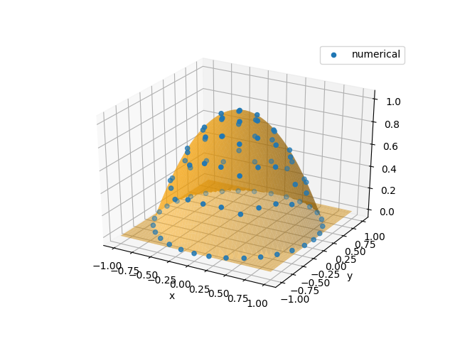

# While Loops

## Motivation

In engineering, we usually need to do for loops, e.g., time stepping, finite element matrix assembling, etc. In pseudocode, we have

```julia
for i = 1:1000000
  global x
	x = do_some_simulation(x)
end
```

To do automatic differentiation in ADCME, direct implemnetation in the above way incurs creation of 1000000 subgraphs, which requires large memories and long dependency parsing time. 

`TensorFlow` provides us a clever way to do loops, where only one graph is created for the whole loops. The basic idea is to create a `while_loop` graph based on five primitives, and the corresponding graph for backpropagation is constructed thereafter. 

## A Simple Example

As a simple example, we consider assemble the external load vector for linear finite elements in 1D. Assume that the load distribution is $f(x)=1-x^2$, $x\in[0,1]$. The goal is to compute a vector $\mathbf{v}$ with $v_i=\int_{0}^1 f(x)\phi_i(x)dx$, where $\phi_i(x)$ is the $i$-th linear element. 

The pseudocode for this problem is shown in the following

```pseudocode
F = zeros(ne+1) // ne is the total number of elements
for e = 1:ne
	add load contribution to F[e] and F[e+1]
end
```


However, if `ne` is very large, writing explicit loops is unwise since it will create `ne` subgraphs. `while_loop` can be very helpful in this case (the script can also be found in https://github.com/kailaix/ADCME.jl/tree/master/examples/while_loop/while_loop_simple.jl)

```julia
using ADCME

ne = 100
h = 1/ne
f = x->1-x^2
function cond0(i, F_arr)
    i<=ne+1
end
function body(i, F_arr)
    fmid = f(cast(i-2, Float64)*h+h/2)
    F = vector([i-1;i], [fmid*h/2;fmid*h/2], ne+1)
    F_arr = write(F_arr, i, F)
    i+1, F_arr
end

F_arr = TensorArray(ne+1)
F_arr = write(F_arr, 1, constant(zeros(ne+1))) # inform `F_arr` of the data type by writing at index 1
i = constant(2, dtype=Int32)
_, out = while_loop(cond0, body, [i,F_arr]; parallel_iterations=10)
F = sum(stack(out), dims=1)
sess = Session(); init(sess)
F0 = run(sess, F)
```


## A practical application

In this section, we demonstrate how to assemble a finite element matrix based on `while_loop` for a 2D Poisson problem. We consider the following problem
$$\begin{aligned}
\nabla \cdot ( D\nabla u(\mathbf{x}) ) &= f(\mathbf{x})& \mathbf{x}\in \Omega\\
u(\mathbf{x}) &= 0 & \mathbf{x}\in \partial \Omega
\end{aligned}$$
Here $\Omega$ is the unit disk. We consider a simple case, where
$$\begin{aligned}
D&=\mathbf{I}\\
f(\mathbf{x})&=-4
\end{aligned}$$
Then the exact solution will be 
$$u(\mathbf{x}) = 1-x^2-y^2$$
The weak formulation is
$$\langle \nabla v(\mathbf{x}), D\nabla u(\mathbf{x}) \rangle = \langle f(\mathbf{x}),v(\mathbf{x}) \rangle$$
We  split $\Omega$ into triangles $\mathcal{T}$ and use piecewise linear basis functions. Typically, we would iterate over all elements and compute the local stiffness matrix for each element. However, this could result in a large loop if we use a fine mesh. Instead, we can use `while_loop` to complete the task. In `ADCME`, the syntax for `while_loop` is 

```julia
while_loop(condition, body, loop_vars)
```

here `condition` and `body` take `loop_vars` as inputs. The former outputs a bool tensor indicating whether to terminate the loop while the latter outputs the updated `loop_vars`. `TensorArry` is used to store variables that change during the loops. The codes for assembling FEM is

```julia
function assemble_FEM(Ds, Fs, nodes, elem)
    NT = size(elem,1)
    cond0 = (i,tai,taj,tav, tak, taf) -> i<=NT
    elem = constant(elem)
    nodes = constant(nodes)
    function body(i, tai, taj, tav, tak, taf)
        el = elem[i]
        x1, y1 = nodes[el[1]][1], nodes[el[1]][2]
        x2, y2 = nodes[el[2]][1], nodes[el[2]][2]
        x3, y3 = nodes[el[3]][1], nodes[el[3]][2]
        T = abs(0.5*x1*y2 - 0.5*x1*y3 - 0.5*x2*y1 + 0.5*x2*y3 + 0.5*x3*y1 - 0.5*x3*y2)
        D = Ds[i]; F = Fs[i]*T/3
        v = T*stack([D*((-x2 + x3)^2/(x1*y2 - x1*y3 - x2*y1 + x2*y3 + x3*y1 - x3*y2)^2 + (y2 - y3)^2/(x1*y2 - x1*y3 - x2*y1 + x2*y3 + x3*y1 - x3*y2)^2),D*((x1 - x3)*(-x2 + x3)/(x1*y2 - x1*y3 - x2*y1 + x2*y3 + x3*y1 - x3*y2)^2 + (-y1 + y3)*(y2 - y3)/(x1*y2 - x1*y3 - x2*y1 + x2*y3 + x3*y1 - x3*y2)^2),D*((-x1 + x2)*(-x2 + x3)/(x1*y2 - x1*y3 - x2*y1 + x2*y3 + x3*y1 - x3*y2)^2 + (y1 - y2)*(y2 - y3)/(x1*y2 - x1*y3 - x2*y1 + x2*y3 + x3*y1 - x3*y2)^2),D*((x1 - x3)*(-x2 + x3)/(x1*y2 - x1*y3 - x2*y1 + x2*y3 + x3*y1 - x3*y2)^2 + (-y1 + y3)*(y2 - y3)/(x1*y2 - x1*y3 - x2*y1 + x2*y3 + x3*y1 - x3*y2)^2),D*((x1 - x3)^2/(x1*y2 - x1*y3 - x2*y1 + x2*y3 + x3*y1 - x3*y2)^2 + (-y1 + y3)^2/(x1*y2 - x1*y3 - x2*y1 + x2*y3 + x3*y1 - x3*y2)^2),D*((-x1 + x2)*(x1 - x3)/(x1*y2 - x1*y3 - x2*y1 + x2*y3 + x3*y1 - x3*y2)^2 + (-y1 + y3)*(y1 - y2)/(x1*y2 - x1*y3 - x2*y1 + x2*y3 + x3*y1 - x3*y2)^2),D*((-x1 + x2)*(-x2 + x3)/(x1*y2 - x1*y3 - x2*y1 + x2*y3 + x3*y1 - x3*y2)^2 + (y1 - y2)*(y2 - y3)/(x1*y2 - x1*y3 - x2*y1 + x2*y3 + x3*y1 - x3*y2)^2),D*((-x1 + x2)*(x1 - x3)/(x1*y2 - x1*y3 - x2*y1 + x2*y3 + x3*y1 - x3*y2)^2 + (-y1 + y3)*(y1 - y2)/(x1*y2 - x1*y3 - x2*y1 + x2*y3 + x3*y1 - x3*y2)^2),D*((-x1 + x2)^2/(x1*y2 - x1*y3 - x2*y1 + x2*y3 + x3*y1 - x3*y2)^2 + (y1 - y2)^2/(x1*y2 - x1*y3 - x2*y1 + x2*y3 + x3*y1 - x3*y2)^2)])
        tav = write(tav, i, v)
        ii = vec([elem[i] elem[i] elem[i]]')
        jj = [elem[i]; elem[i]; elem[i]]
        tai = write(tai, i, ii)
        taj = write(taj, i, jj)
        tak = write(tak, i, elem[i])
        taf = write(taf, i, stack([F,F,F]))
        return i+1, tai, taj, tav, tak, taf
    end
    tai = TensorArray(NT, dtype=Int32)
    taj = TensorArray(NT, dtype=Int32)
    tak = TensorArray(NT, dtype=Int32)
    tav = TensorArray(NT)
    taf = TensorArray(NT)
    i = constant(1, dtype=Int32)
    i, tai, taj, tav, tak, taf = body(i, tai, taj, tav, tak, taf)
    _, tai, taj, tav, tak, taf = while_loop(cond0, body, [i, tai, taj, tav, tak, taf]; parallel_iterations=10)
    vec(stack(tai)[1:NT]'), vec(stack(taj)[1:NT]'), vec(stack(tav)[1:NT]'),
                        vec(stack(tak)[1:NT]'), vec(stack(taf)[1:NT]')
end
```

## Code detail explained

We now explain the codes. 

We assume that `nodes` is a $n_v\times 2$ tensor holding all $n_v$ coordinates of the nodes, `elem` is a $n_e\times 3$  tensor holding all $n_e$ triangle vertex index triples. We create five `TensorArray` to hold the row indices, column indices and values for the stiffness matrix, and row indices and values for the right hand side (Here `NT` denotes $n_e$):

```
tai = TensorArray(NT, dtype=Int32)
taj = TensorArray(NT, dtype=Int32)
tak = TensorArray(NT, dtype=Int32)
tav = TensorArray(NT)
taf = TensorArray(NT)
```

Within each loop (`body`), we extract the coordinates of each vertex coordinate

```julia
el = elem[i]
x1, y1 = nodes[el[1]][1], nodes[el[1]][2]
x2, y2 = nodes[el[2]][1], nodes[el[2]][2]
x3, y3 = nodes[el[3]][1], nodes[el[3]][2]
```

and compute the area of `i`th triangle

```
T = abs(0.5*x1*y2 - 0.5*x1*y3 - 0.5*x2*y1 + 0.5*x2*y3 + 0.5*x3*y1 - 0.5*x3*y2)
```

The local stiffness matrix is computed and vectorized (`v`). It is computed symbolically.  To store the computed value into `TensorArray`, we call the `write` API (there is also `read` API, which reads a value from `TensorArray`)

```julia
tav = write(tav, i, v)
```

Note we have called 

```julia
i, tai, taj, tav, tak, taf = body(i, tai, taj, tav, tak, taf)
```

before we call `while_loop`. This is because we need to initialize the `TensorArray`s (i.e., telling them the size and type of elements in the arrays). We must guarantee that the sizes and types of the elements in the arrays are consistent in `while_loop`. 

Finally, we stack the `TensorArray` into a tensor and vectorized it according to the row major. This serves as the output of `assemble_FEM`. The complete script for solving this problem is [here](https://github.com/kailaix/ADCME.jl/tree/master/examples/while_loop/while_loop.jl) and the following plot shows the numerical result and corresponding reference solution. 



## Gradients that backpropagate through loops

To inspect the gradients through the loops, we can run 

```julia
println(run(sess, gradients(sum(u), Ds))) # a sparse tensor
```

This outputs a sparse tensor instead of a full tensor. To obtain the full tensor, we could call `tf.convert_to_tensor`

```julia
println(run(sess, tf.convert_to_tensor(gradients(sum(u), Ds)))) # full tensor
```


